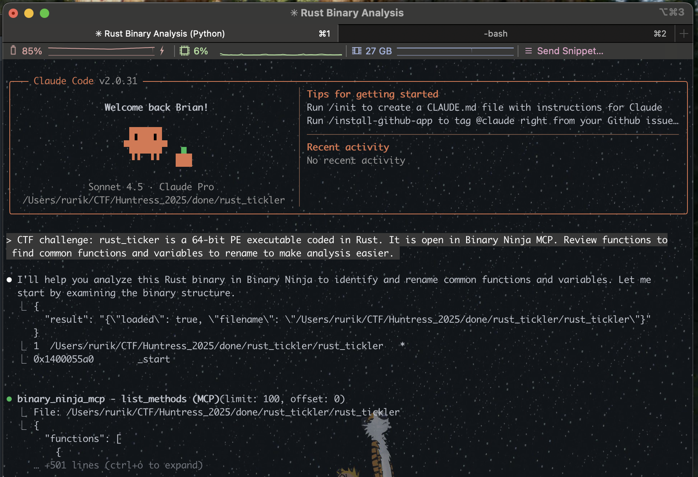
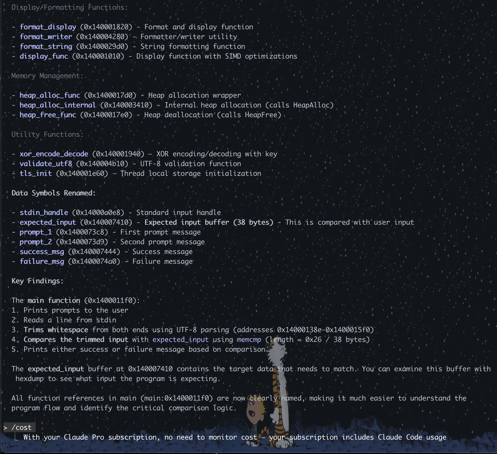
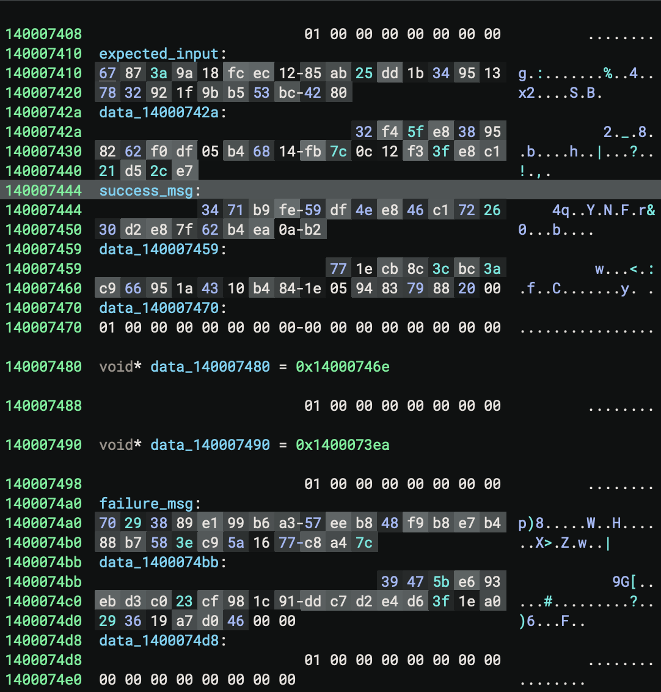
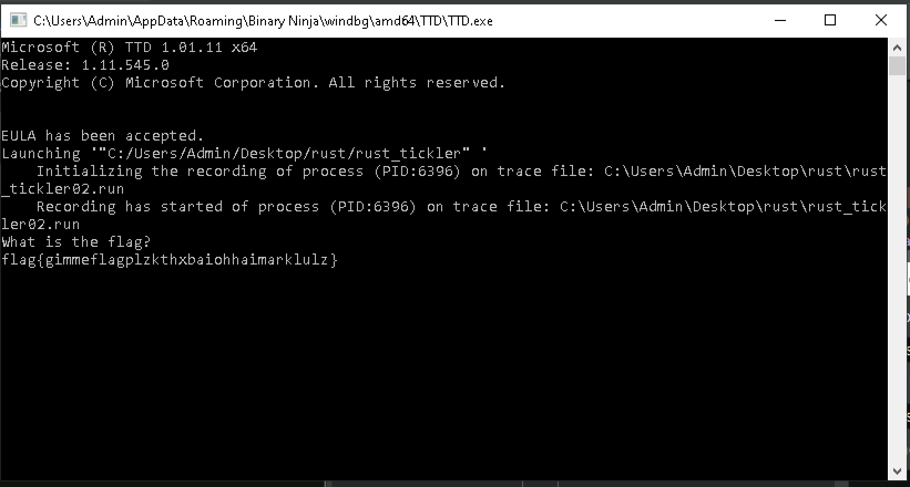
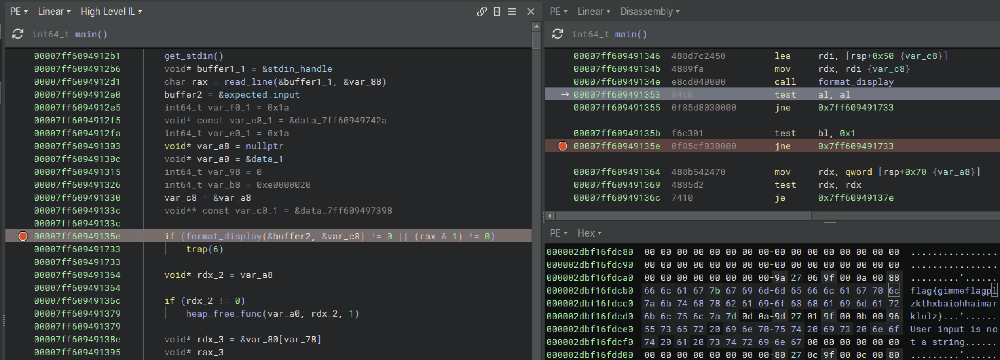
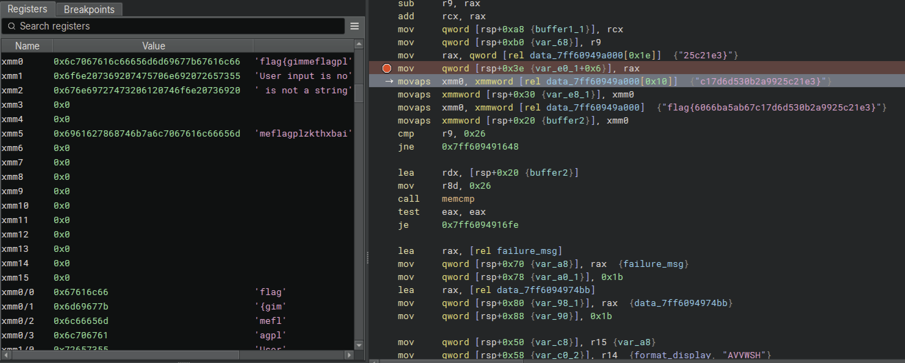

# Rust Tickler 1

```
Category    Author
⚙️ Reverse Engineering  @Nordgaren

Ooooh Rust! AND tickles? Rusty tickles...?
```

For various reasons I wasn't a serious competitor in the Huntress CTF for 2025, but I did seek out the more interesting and challenging tasks. As part of the reverse engineering ones I was enjoying learning more about Binary Ninja's Time Travel Debugging (TTD). I decided to do a write-up of the three Rust Tickler challenges while focusing on using BN TTD.

Warning: I use an ultrawide monitor, so all screenshots were taken on that. 

Let's start with the easiest, and put on some nice chill music.

<div align="center"><a href="http://www.youtube.com/watch?feature=player_embedded&v=UclCQ3zJOt4" target="_blank"><br>YouTube Link</a></div>


The provided binary was just a simple, small executable with the warning that it was written in Rust:

```
File Name       : rust_tickler
File Size       : 35,328
MD5             : 490870ffbb32185e00ff211118035eb0
SHA1            : fde62eb6045d8e69f737aa8fb8dd961002cbb20d
SHA256          : df95140548732f34d8cf11b6b9dd7addb31480fab871b7004c7c1e09acfd920b
Magic           : PE32+ executable for MS Windows 6.00 (console), x86-64, 5 sections
Import Hash     : 674cecfb67780800ece401714a82a0cf
Compiled Time   : Tue Oct  7 21:17:10 2025 UTC
PE Sections (5) : Name       Size       SHA256
                  .text      22,528     e474b3458adcfbb46ab46bd02113adb42dedd619a4c936bfe7a9d74f62de99f8
                  .rdata     9,728      cb0c7a697bf820056d236bb8d4d28952d3dce01386bb19fe3f02789fa87a6178
                  .data      512        524055496e605fe98ce614346760cb2701cba2fe88d254d282cc904fc0d5e2a4
                  .pdata     1,024      89bbf2ae8ea32e352ce8448440dd5ea73938411dbe220e27729d49c9c3292913
                  .reloc     512        1ea1bfcf2c67c0d601a7c7942d63dfa288e6f5e5df6f22c787ade72330180941
```

Running strings showed oddly that there were no real strings, just one obscure line:


```
7=06*gagg30d03gf2`f5g5dba3c0hhcd2c`4b,
```


Cool

When reversing Rust it isn't straightforward how to find main(), but through a bit of poking you'll find it. If you can't, find interesting code and work backwards until you go too far and get into init


A few weird traps that signal short circuits we should look at later. And a lot of obvious bitwise math checks that are byte-by-byte.


We see some primary code that looks like flag checking. Weird value, a few calls, a memcmp against something 0x26 (38) bytes long. We know flag{} structure is 38 bytes, so there's our goal.


Now that main() is found, and I renamed it, I do a very quick AI cleanup to identify common things. This helps me to getting stuck in unusual code that is actually just optimized standard Windows routines.

This did the tedious work of finding basic routines that are buried within calls, subcalls, etc. And ensures I don't accidentally dig into memory management.



Claude Pro has paid dividends over the past year :) 



Claude pointed out some very obvious hardcoded values that we would've found. I bet success_msg and failure_msg were assumed values just because of a potential flag check it saw. Expected_input is the only odd one out that is used for actual comparison checking?



I typically do static analysis on a Mac host, a new habit formed by work laptops being ARM-based without good access to an Intel-VM. But, working off my Intel MBP for this, so copied the Binary Ninja database into my Windows VM for detonation.

There, just open BN, ensure TTD package is installed and on the Development Build update channel, then start TTD.


Ignoring the standard TTD.exe output, we see the challenge prompt: "What is the flag?"
I made a very reasonable, scientic guess with my fingers crossed .. it didn't work.



That's fine. So, we start the process. TTDs benefit is that it allows full time travel during the execution flow. The recording "run" is stored for replay. WinDbg and Binary Ninja can read this run and find the actual events that occurred at each step, replaying them back to you. WinDbg has had this feature for a long time but it is very cumbersome to use (just as WinDbg is). The benefit here is that Binary Ninja's debugger that usually does F7/F8 (step) or F9 (run), can now do Shift-F7/F8 (step backwards) or Shift-F9 (run backwards). Miss an action? Just step back. Trying to blackbox a routine? Just F8/Shift-F8 over the call while you analyzing the inputs and outputs. And instead of mentally rebuilding a function argument stack, BH's debugger inspection just shows the values easily.

So, let's start by making sure we can find our input value in memory after it is prompted. We still hit the crux of the challenge in that there are no actual strings. So, by stepping over functions and monitoring outputs, I finally see a text error message constructed and staged for potential display in an upcoming check. 



So, let's now scroll down to the weird text and ... sigh. There's the flag. That was very anti-climatic. Binary Ninja shows values as they exist in memory, not in the file. So it knows that the string was decrypted back to text, and just shows its final value. Challenge over. 

```
flag{6066ba5ab67c17d6d530b2a9925c21e3}
```


But let's just look to see how it was created. There is no obvious string encryption XOR loops, the value just appears out of nowhere. And that's because it was being performed on the floating point registers (xmm*). Most debuggers hide these away and make them very difficult to view, typically displaying them as numbers with scientific notation. In BN we can display them as hex. BN will then determine it's text and will provide a "hint" value of the contents.



All that leads to the final memcmp(). Here, the Binary Ninja TTD Debugger info gives a quick view at the argument stack at that specific point in time, showing the actual strings being sent in.


Pa pa ya!

<div align="center"><a href="http://www.youtube.com/watch?feature=player_embedded&v=oO7Y8NsnkRg" target="_blank"><br>YouTube Link</a></div>

