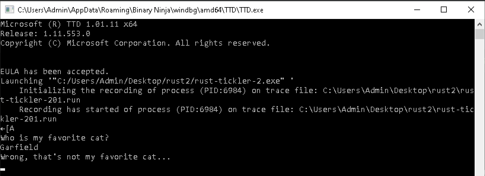
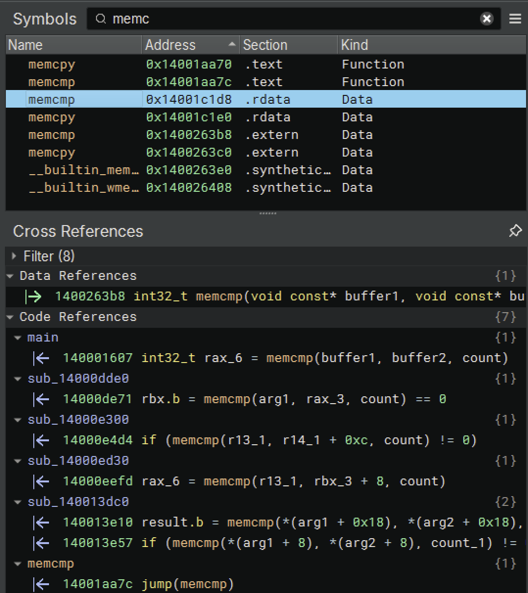
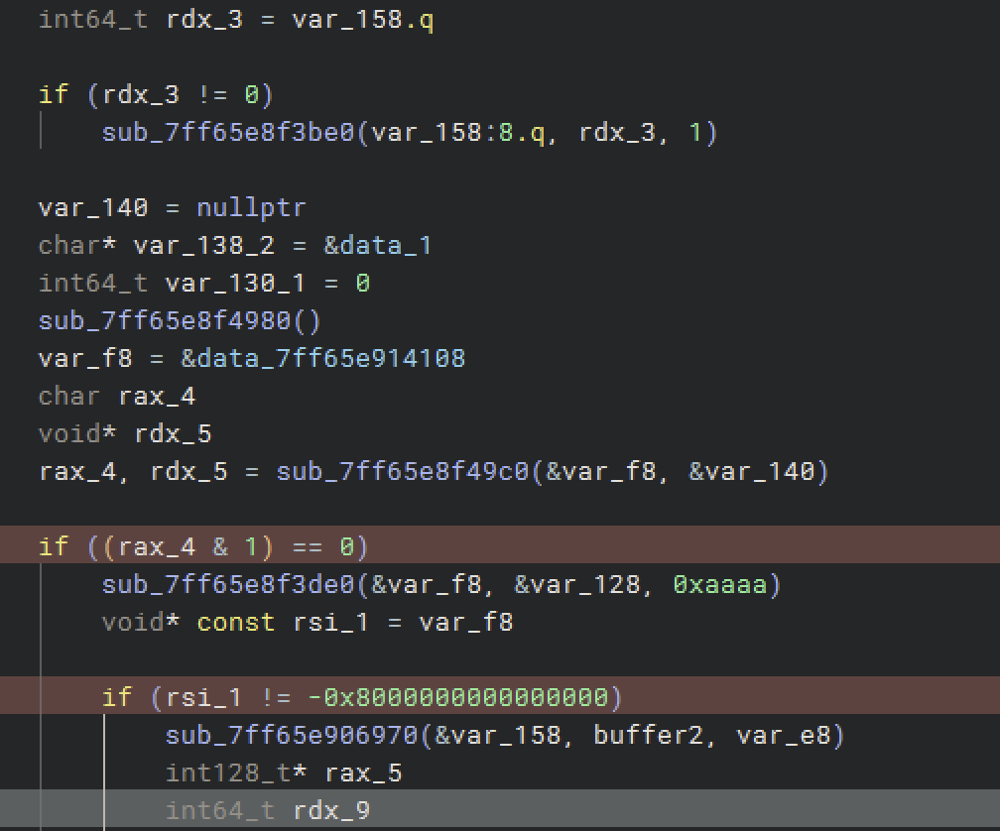
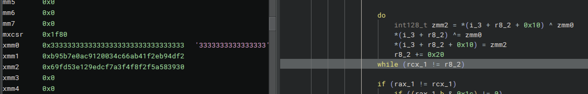
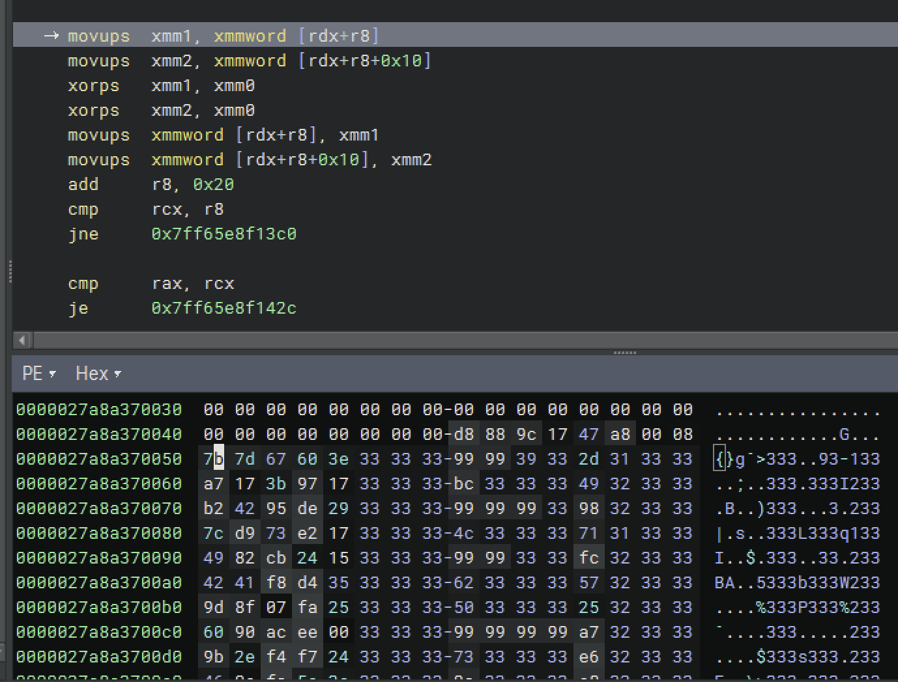
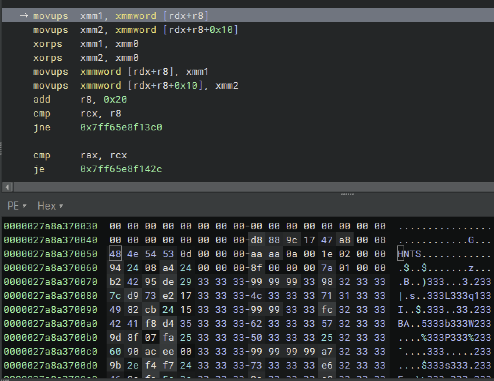
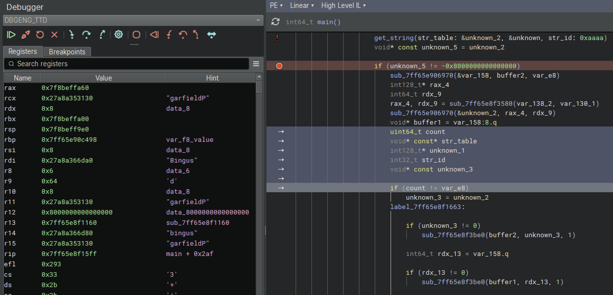
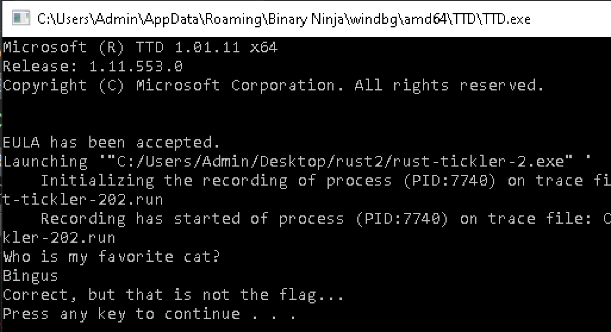

# Rust Tickler 2

```
Category    Author
⚙️ Reverse Engineering  @Nordgaren

You all looked like you were having so much fun reverse engineering Rust code... why not do it again!?
```

Let's skip straight to Claude doing markup. Because it finds rust_main_entry pretty easily but also does some of our analysis for us (by accident in a write up :)) 


```
  The main function (main_decrypt_and_validate at 0x140001350) now has inline comments explaining:
  - XOR decryption with key 0x33
  - HTNS format parsing
  - Entry lookups by ID (0xAAAAAAAA, 0xAAAA, 0xAAAAAA)
  - User input comparison (case-insensitive, trimmed)
  - Command execution (cmd.exe /c pause) on successful validation

  The analysis reveals this is a CTF challenge that:
  1. XORs encrypted data with 0x33
  2. Parses the result as HTNS format
  3. Prompts for user input
  4. Compares it against decrypted values
  5. Executes "pause" command if correct
```

Oof. That ... did a lot. But I didn't actually do that when I looked at the file. And maybe I should have, as it would've saved me a lot of time :) However, as you may see later, there are some outright errors in Claude's output. So, instead I'll revert that and walk through some of how I actually did it, and assumptions made along the way.

Let's dance!

<div align="center"><a href="http://www.youtube.com/watch?feature=player_embedded&v=yepUXS9k6DM" target="_blank"><br>Attack Attack! - Dance!</a></div>


With main() quickly found, we look for any major logic checks to determine flow. Especially any early short circuits to die Find main check for one big logic flow. Here, early on is a big logic check based on the output of a previous call, followed by another function leading to a second check. Then more and more levels of checks before getting to a memcmp().

I looked around the area to find any obvious stand-outs like Tickler 1 had, but just more basic FPU obfuscation. Nothing super simple.


This is a good time to just move my work into a Windows VM and kick off my first TTD run. Similar to the first, a basic console window with a string input. "Who is my favorite cat?"



I try to find good breakpoints to begin analysis. Going to Binary Ninja symbol view I find memcmp and see that there's only one usage within main(). That's a good place to set a BP and run.



Oops. It never got there and somehow terminated here. But we'll use TTD to help here. 


First, Shift-G to get our current timestamp "2F2:0". So we have some measurement in time to compare against, to at least know if something we'll review earlier may be halfway through, etc.


The thing about being trapped is that in Windows API-land you may be 30 subroutines deep in calls. And that's exactly where this is. So, you can Shift-F8 step your way out ... dozens of times. Or, just go back to main and set some more realistic breakpoints. Then just Shift-F9 to run blindly backwards until one is hit. That should put you very close to the failed check. I see that a comparison to var_f8 fails because var_f8 was set to 0x08 ... why? Don't know. I reviewed the data in and out of this routine and it didn't make sense. So, put a pin in that and come back later.



While here I start getting sidetracked with the FPU XOR I saw earlier and wanted to trace along. We see a large string of "3"s loaded into xmm0 and then used to XOR decrypt a large block of data. This takes a very large block of weird "3"s in memory and unveils a "HNTS" block. 





Now we're getting somewhere fun! Time to start some happy rage!

<div align="center"><a href="http://www.youtube.com/watch?feature=player_embedded&v=EpXtD6dD0MU" target="_blank"><br>BABYMETAL - from me to u (feat. Poppy)</a></div>


I want to see how this data is being used later. Using TTD I set a watch on the memory address to get all Reads and Writes to it over the entire execution. There are many ways to read this, all with useful context. First I want to make sure we have our Writes as we expect. If this was a simple byte-by-byte XOR, we'd see 1-byte Writes. There are some 8-byte, 16-byte, and even 32-byte writes. 

You can see the original contents, changes made during XOR, and the final results (0x53544e48 = STNH = HNTS)


The last write corresponds to the XOR. But the last read? And why is there only one read and then it's done?
From this table you can double click on any time stamp to go to that RIP, with the registers set. However, it's actually at the RIP after the change was made. So you would realistically step back one. In this case, it was stepping back out of multiple functions to get to a memcmp within sub_7ff65e8f3ea0.

With the memcmp highlighted we can see the contents. 4 bytes from some buffer compared against "HNTS", at the memory address we were watching. The new buffer then has a magic check for HNTS. (Why not do a magic check before copying the old buffer over? :)) 

```
  memcpy(dest: &var_78, src: arg2, count: r12.d)
  
  if (var_78 != 'HNTS')
  label_7ff65e8f3ef3:
      arg1.b = 0x15
      result[1] = sub_7ff65e8f4130(arg1.b, "Invalid magic<redacted>", 0xd)
      *result = -0x8000000000000000
  else
  label_7ff65e8f3f2a:
      int32_t var_74 = 0
      char* rdx_1 = &arg2[r12]
      int64_t rax_4 = arg3 - r12
      int64_t r13_1 = 4
```


So that's why there's only one read, there was a memcpy elsewhere. After that it moves to varying offsets within that data set but never refers to the original. Going back up, this all occurs directly after the XOR routines:

```
          do
              *(i_3 + rcx_1) ^= 0x33333333
              rcx_1 += 4
          while (r9_2 != rcx_1)
          
          if (rax_1 != r9_2)
              goto label_7ff65e8f142a
      i_3 = data_7ff65e9140e8
      r8_1 = data_7ff65e9140f0
  
  void* const var_f8
  sub_7ff65e8f3ea0(&var_f8, i_3, r8_1)
  
  if (not(add_overflow(0, neg.q(var_f8))))
      int128_t var_128 = var_f8.o
      sub_7ff65e8f3de0(&var_f8, &var_128, 0xaaaaaaaa)
```

So we're starting to get a basic picture of it decrypting a payload and preparing it for processing in order to display strings. XOR the data payload, run it through some sub_7ff65e8f3ea0(), then run it again through sub_7ff65e8f3de0 (now renaming to get_string()) with a hardcoded ID (0xaaaaa).

Let's go dump all that data to disk to play with later:

```
00000000: 48 4e 54 53 0d 00 00 00 aa aa 0a 00 1e 02 00 00  HNTS............
00000010: 94 24 08 a4 24 00 00 00 8f 00 00 00 7a 01 00 00  .$..$.......z...
00000020: 81 71 a6 ed 1a 00 00 00 aa aa aa 00 ab 01 00 00  .q..............
00000030: 4f ea 40 d1 24 00 00 00 7f 00 00 00 42 02 00 00  O.@.$.......B...
00000040: 7a b1 f8 17 26 00 00 00 aa aa 00 00 cf 01 00 00  z...&...........
00000050: 71 72 cb e7 06 00 00 00 51 00 00 00 64 01 00 00  qr......Q...d...
00000060: ae bc 34 c9 16 00 00 00 63 00 00 00 16 01 00 00  ..4.....c.......
00000070: 53 a3 9f dd 33 00 00 00 aa aa aa aa 94 01 00 00  S...3...........
00000080: a8 1d c7 c4 17 00 00 00 40 00 00 00 d5 01 00 00  ........@.......
00000090: 75 3f c9 6f 0d 00 00 00 a9 00 00 00 fb 01 00 00  u?.o............
000000a0: b8 23 97 ce 23 00 00 00 83 00 00 00 d8 00 00 00  .#..#...........
000000b0: d0 00 12 aa 3e 00 00 00 9f 00 00 00 e2 01 00 00  ....>...........
000000c0: 2d f5 78 81 19 00 00 00 a1 00 00 00 49 01 00 00  -.x.........I...
000000d0: ed e2 b4 aa 1b 00 00 00 4b 8a 88 d0 3c cc 6b 78  ........K...<.kx
000000e0: de 6b 98 26 42 d0 8b cc a9 56 47 97 c8 b0 6e 52  .k.&B....VG...nR
000000f0: b9 dc 5f c6 85 5d 90 c9 d1 0f 64 c9 35 72 81 aa  .._..]....d.5r..
00000100: 35 af 68 3f 9c 86 ff 5f 70 25 bb 95 1f 1c 3d ec  5.h?..._p%....=.
00000110: a5 a7 cc f1 b3 a1 4f 4c 7b 22 94 e2 2d 0e 0a 29  ......OL{"..-..)
00000120: 47 06 5b 06 67 58 cf d7 da 35 20 11 d0 04 ca 36  G.[.gX...5 ....6
00000130: 89 6b ff ed 64 02 3d f5 ed 77 12 c8 15 be 37 fe  .k..d.=..w....7.
00000140: a5 8d 2c 3c c1 36 b0 77 92 6a c9 97 46 2b f3 0f  ..,<.6.w.j..F+..
00000150: c3 72 07 a3 5b 59 1b bd e8 cd 48 48 6e 8b 0b 2a  .r..[Y....HHn..*
00000160: 5c 29 6b 2b b0 9e d9 a4 a7 d7 c1 ff 7b 0a 41 99  \)k+........{.A.
00000170: db e7 c5 ca a0 4f e9 59 cd 51 f2 09 5c c9 05 c3  .....O.Y.Q..\...
00000180: 25 9a 49 df 15 0f 1c b8 e2 a2 11 d6 64 f1 e3 fe  %.I.........d...
00000190: 0e 92 8d ad 22 3a 02 97 0f b4 60 1d 8e b2 e5 f0  ....":....`.....
000001a0: d9 b6 52 47 5b 10 6a 07 d5 b7 8b cc 6b 98 24 6c  ..RG[.j.....k.$l
000001b0: 6b 2b 43 84 6e 45 e7 49 42 3e 00 ff 25 5b 87 33  k+C.nE.IB>..%[.3
000001c0: 5d 37 97 76 b4 e5 26 1f ee d9 4b 89 4e 38 e8 7c  ]7.v..&...K.N8.|
000001d0: f0 e0 fe 90 7d 08 b8 b0 cd a4 35 34 97 d4 be de  ....}.....54....
000001e0: 5f bf a6 8d f6 bc 88 04 0d c0 ba d5 29 47 4f 4e  _...........)GON
000001f0: f0 d4 9e 8d 48 43 92 65 7e a2 06 3f 3e 8b 08 a1  ....HC.e~..?>...
00000200: 14 c7 f6 a0 51 6d 0a c8 5f 61 22 0f 3b 22 8e 9a  ....Qm.._a".;"..
00000210: e5 f3 b5 ab c3 94 e5 f4 d6 4e de 07 7a d0 22 a5  .........N..z.".
00000220: 44 18 66 ea a6 88 0f bb 2c f7 85 33 5a ac 62 61  D.f.....,..3Z.ba
00000230: 8f ab 2d a4 71 36 7e 12 94 51 18 6f 14 9f 2b 1e  ..-.q6~..Q.o..+.
00000240: f2 4d b9 2e 1f b4 6a c6 34 00 12 c9 0a 7e 5b b9  .M....j.4....~[.
00000250: 30 39 58 5a 2f 8f 4f 3f 7a cf ed 29 e1 53 fd 69  09XZ/.O?z..).S.i
00000260: 07 4e ad fd b6 1d 4a a7 2e 88 9d e0 21 a8 00 00  .N....J.....!...
00000270: 50 01 35 8a 7a 02 00 00 c0 a6 36 8a 7a 02 00 00  P.5.z.....6.z...
```

Looking into the sub_7ff65e8f3ea0, it checks HNTS and then a series of other 4-byte checks, but no real data checks. Just moving data around. So, run out and get get_string() more. 

```
get_string(&var_f8, &var_128, 0xaaaaaaaa)
```

I see var_f8 SHOULD be that table, but in xmm0 it's set to: 0x27a8a3702c00000000000000010
That first DWORD is the same as an address without our mapped space, but it is not referenced in the calls? Coincidence?

Knowing we're dealing with a lot of floating point SIMD data, I watch the xmm values as I step over the get_string() sub:
```
xmm0: 0x27a8a35f0f00000000000000017
xmm1: 0x69726f76616620796d207369206f6857 'Who is my favori'
xmm2: 0x3f74616320657469726f76616620796d 'my favorite cat?'
```

w00t!

Nice, so that routine gets our strings, likely from that table.
get_string(&var_f8, &var_128, 0xaaaaaaaa)

Going in are just a bunch of byte validation junk, until I see this beauty:
```
  if (rax_2 != 0)
      rbx = rax_2
      memcpy(dest: rax_2, src: r12_1, count: rdi.d)
      int32_t rax_3 = *(arg1 + 0x18)
      int64_t i
      
      if (rdi != 1)
          i = 0
          
          do
              rbx[i] ^= ((rax_3 * 0x19660d + 0x3c6ef35f) u>> 0x18).b
              rax_3 = rax_3 * 0x17385ca9 + 0x47502932
              rbx[i + 1] ^= (rax_3 u>> 0x18).b
              i += 2
          while ((0x7ffffffffffffffe & rdi) != i)
      else
          i = 0
      
      if ((rdi.b & 1) != 0)
          rbx[i] ^= ((rax_3 * 0x19660d + 0x3c6ef35f) u>> 0x18).b
      
      goto label_7ff65e8f43d8
```


Oh bestill my heart! Lots of constants, with the math based upon rax3 (arg1[0x18]).


<div align="center"><a href="http://www.youtube.com/watch?feature=player_embedded&v=cdkBs0VCSX0" target="_blank"><br>TURISAS - Rasputin</a></div>


I Shift-F4 run backward to the start of it to see what's happening
memcpy with 17 bytes of data:
```
00000000: 22 3a 02 97 0f b4 60 1d 8e b2 e5 f0 d9 b6 52 47  ":....`.......RG
00000010: 5b 10 6a 07 d5 b7 8b 00 9a 1c dc bb 00 34 00 80  [.j..........4..
```

I follow the output buffer of rcx and start walking into the math
This became:
```
00000000: 57 68 6f 20 69 73 20 6d 79 20 66 61 76 6f 72 69  Who is my favori
00000010: 74 65 20 63 61 74 3f 00                          te cat?.
```
It was xor'ing every two bytes, then one last xor for any left over byte.

Knowing this, I go back to the start and end of get_string() and look at xmm values for more comparisons:

```
xmm0: 0x27a8a35fec00000000000000024
xmm1: 0x6f6e20732774616874202c676e6f7257 'Wrong, that\'s no'
xmm5: 0x796d20746f6e20732774616874202c67 'g, that\'s not my'
```

xmm0 is actually a memory address in the higher half and the str length in the lower half.

Seeing that this is a failure message being formed, I look upward for the checks to get here and Shift-F4 there:

```
      sub_7ff65e906970(&var_f8, rax_5, rdx_9)
      void* buffer1 = var_158:8.q
      uint64_t count
      void* const* rcx_16
      int128_t* rdx_14
      int32_t r8_6
      void* const rdx_12
      
      if (count != var_e8)
          rdx_12 = var_f8
      label_7ff65e8f1663:
          
          if (rdx_12 != 0)
              sub_7ff65e8f3be0(buffer2, rdx_12, 1)
```

At this point, in the registers I see my guess "garfield" as well as "Bingus" and "bingus". I just need to look at the values during cmp




Sweet. There's our cat name comparison. 

Bingus

Yes, we took a very long path to get here, as I could've come here from the very beginning, but I wanted to better understand the code first.

Knowing this, I run TTD for a second time and enter the correct cat name.

... And still failed the check.



OK. So the challenge at this point seems to be targeting the string table to get other values out of it. I could start brute forcing the values, but let's do it systematically. First, go back and use the first TTD run so that my base address syncs across all runs for note-taking.

Let's get a better understanding of what is going in and out of get_string().

Here's the first one:

```
❗️00007ff65e8f148e                get_string(&var_f8, &var_128, 0xaaaaaaaa) 
```
(Emojis are not from AI, they are Binja's labeling system. It's sad that has to be said in this day and age)


```
  int128_t* get_string(int128_t* str_table, void* arg2, int32_t str_id)
      void* rax_1 = *(arg2 + 8) - 0x28
      int64_t rdx = *(arg2 + 0x10) * 0x28
      void* rcx_2
      bool cond:0_1
      
      do
          if (rdx == 0)
              *str_table = -0x8000000000000000
              return str_table
          
          rcx_2 = rax_1 + 0x28
          rdx -= 0x28
          cond:0_1 = *(rax_1 + 0x48) != str_id
          rax_1 = rcx_2
      while (cond:0_1)
      int64_t var_38 = 0
```

But still no idea what arg2 / var_128 are so I set a TTD write watch on it. However, the results are unreliable. The address is used dozens of times with many random values, so it's in constant reuse. But, everytime it goes into this routine it's 0x100.

That means nothing to me. Let's switch to focus on static analysis based on what I got.

```
if (decrypt_str_actual(rcx_2, &var_20) != 0)
```

Looking at HNTS data, there's structure to the beginning, then a lot of bytes. Table of contents? I see 0xaaaa, 0xaaaaaa. Yeah. Definitely some sort of table of contents with a set structure.


At this point I realize I could just manually change the bytes going in while debugging to brute force a flag out :) But I wanted to find a complete solution.

Tekkno Train vibes from now on

<div align="center"><a href="http://www.youtube.com/watch?feature=player_embedded&v=CFlhlZbeKgE" target="_blank"><br>Electric Callboy - TEKKNO TRAIN</a></div>


But, something is still off. The data going into get_string() looks nothing like the original data block where we know the string is coming from. So, we need to go back and review the earlier HNTS validation routine. It's only called once, and then the results are reused across multiple string calls. I see the HNTS going in as arg2 and a hardcoded number 616 as arg3.

```
  void* const unknown_2
  sub_7ff65e8f3ea0(&unknown_2, HNTS_data, num_616)
  
  if (not(add_overflow(0, neg.q(unknown_2))))
      int128_t unknown = unknown_2.o
      get_string(str_table: &unknown_2, &unknown, str_id: 0xaaaaaaaa)
```

I go into this routine and do some basic variable markup.

```
  int64_t* sub_7ff65e8f3ea0(int64_t* arg1, char* HNTS_data, int64_t num_616)
      int64_t* result = arg1
      int32_t var_78 = 0
      int64_t r12 = 4
      
      if (num_616 u< 4)
          r12 = num_616
      
      if (num_616 == 1)
          var_78.b = *HNTS_data
          
          if (var_78 == 'HNTS')
              goto label_7ff65e8f3f2a
          
          goto label_7ff65e8f3ef3
      
      memcpy(dest: &var_78, src: HNTS_data, count: r12.d)
      
      if (var_78 != 'HNTS')
      label_7ff65e8f3ef3:
          arg1.b = 0x15
          result[1] = sub_7ff65e8f4130(arg1.b, "Invalid magic<redacted>", 0xd)
          *result = -0x8000000000000000
      else
      label_7ff65e8f3f2a:
          int32_t var_74 = 0
          char* rdx_1 = &HNTS_data[r12]
          int64_t rax_4 = num_616 - r12
          int64_t r13_1 = 4
          
          if (rax_4 u< 4)
              r13_1 = rax_4
          
          if (rax_4 != 1)
              memcpy(dest: &var_74, src: rdx_1, count: r13_1.d)
          else
              var_74.b = *rdx_1
          
          uint64_t rax_6 = zx.q(var_74)
          uint64_t rbp_2 = rax_6 << 4
          uint64_t var_50_1
          int32_t* rbx_1
          
          if (rax_6 == 0)
              var_50_1 = 0
              rbx_1 = &data_1
          else
              data_7ff65e914100
              int32_t* rax_8 = sub_7ff65e8f3c00(rbp_2, 1)
              
              if (rax_8 == 0)
                  sub_7ff65e90b210()
                  noreturn
              
              rbx_1 = rax_8
              var_50_1 = rbp_2
          
          int64_t r13_2 = r13_1 + r12
          char* rdx_2 = &HNTS_data[r13_2]
          uint64_t r15_1 = num_616 - r13_2
          
          if (r15_1 u>= rbp_2)
              r15_1 = rbp_2
          
          if (r15_1 != 1)
              memcpy(dest: rbx_1, src: rdx_2, count: r15_1.d)
          else
              *rbx_1 = *rdx_2
          
          int64_t var_68 = 0
          int64_t var_60_1 = 8
          int64_t var_58_1 = 0
          
          if (rax_6 != 0)
              uint64_t var_70_2 = rax_6 << 4
              int64_t r15_2 = 0
              
              do
                  int32_t r12_1 = *(rbx_1 + r15_2)
                  uint64_t r14_2 = zx.q(*(rbx_1 + r15_2 + 4))
                  uint64_t r13_3 = zx.q(*(rbx_1 + r15_2 + 0xc))
                  int64_t rbp_3 = 1
                  
                  if (r13_3 != 0)
                      data_7ff65e914100
                      int64_t rax_12 = sub_7ff65e8f3bd0(r13_3, 1)
                      
                      if (rax_12 == 0)
                          sub_7ff65e90b210()
                          noreturn
                      
                      rbp_3 = rax_12
                  
                  memcpy(dest: rbp_3, src: &HNTS_data[r14_2], count: r13_3.d)
                  int32_t rdi = *(rbx_1 + r15_2 + 8)
                  
                  if (var_58_1 == var_68)
                      sub_7ff65e8f4240(&var_68)
                  
                  int64_t rcx_4 = var_58_1 * 5
                  *(var_60_1 + (rcx_4 << 3)) = r13_3
                  *(var_60_1 + (rcx_4 << 3) + 8) = rbp_3
                  *(var_60_1 + (rcx_4 << 3) + 0x10) = r13_3
                  *(var_60_1 + (rcx_4 << 3) + 0x18) = rdi
                  *(var_60_1 + (rcx_4 << 3) + 0x20) = r12_1
                  var_58_1 += 1
                  r15_2 += 0x10
              while (var_70_2 != r15_2)
          
          result[2] = var_58_1
          *result = var_68
          result[1] = var_60_1
          
          if (var_50_1 != 0)
              sub_7ff65e8f3be0(rbx_1, var_50_1, 1)
      
      return result
```


Let's now step through and figure it out:

```
  if (rax_4 != 1)
      memcpy(dest: &var_74, src: rdx_1, count: r13_1.d)
  else
      var_74.b = *rdx_1
```
It's reading the second DWORD (0x0d). Just from eyeballing based on an apparent structure, this appears to be the number of entries in the string table.

And the entry structure table looks like this:
```
00000000: aa aa 0a 00 1e 02 00 00 94 24 08 a4 24 00 00 00  .........$..$...
00000010: 8f 00 00 00 7a 01 00 00 81 71 a6 ed 1a 00 00 00  ....z....q......
```

I see this verified as at the end it reformats this data into an actual struct. The values all line up to what I was seeing elsewhere.

```
int64_t rcx_4 = var_58_1 * 5
*(var_60_1 + (rcx_4 << 3)) = str_len
*(var_60_1 + (rcx_4 << 3) + 8) = enc_str
*(var_60_1 + (rcx_4 << 3) + 0x10) = str_len
*(var_60_1 + (rcx_4 << 3) + 0x18) = seed
*(var_60_1 + (rcx_4 << 3) + 0x20) = str_id
```

After looking at earlier math, [0x18] aligns to the value used in the routine to influence the math, so I'm assuming it's a seed value.

Knowing all this, time to write a script: hnts_decrypt.py

First run is success:

```
19:17:08-rurik@~/CTF/Huntress_2025/done/rust_tickler_2$ python hnts_decrypt.py
Magic: HNTS
Entries: 13

Parsing TOC
[0] ID: 0x000aaaaa, Seed: 0xa4082494, Size: 36 bytes
[1] ID: 0x0000008f, Seed: 0xeda67181, Size: 26 bytes
[2] ID: 0x00aaaaaa, Seed: 0xd140ea4f, Size: 36 bytes
[3] ID: 0x0000007f, Seed: 0x17f8b17a, Size: 38 bytes
[4] ID: 0x0000aaaa, Seed: 0xe7cb7271, Size: 6 bytes
[5] ID: 0x00000051, Seed: 0xc934bcae, Size: 22 bytes
[6] ID: 0x00000063, Seed: 0xdd9fa353, Size: 51 bytes
[7] ID: 0xaaaaaaaa, Seed: 0xc4c71da8, Size: 23 bytes
[8] ID: 0x00000040, Seed: 0x6fc93f75, Size: 13 bytes
[9] ID: 0x000000a9, Seed: 0xce9723b8, Size: 35 bytes
[10] ID: 0x00000083, Seed: 0xaa1200d0, Size: 62 bytes
[11] ID: 0x0000009f, Seed: 0x8178f52d, Size: 25 bytes
[12] ID: 0x000000a1, Seed: 0xaab4e2ed, Size: 27 bytes
Strings:

[0] ID: 0x000aaaaa, Seed: 0xa4082494, Raw size: 36
    Encrypted: 22a5441866eaa6880fbb2cf785335aac62618fab2da471367e129451186f149f2b1ef24d
    Decrypted: 436f72726563742c206275742074686174206973206e6f742074686520666c61672e2e2e
    Text: 'Correct, but that is not the flag...'

[1] ID: 0x0000008f, Seed: 0xeda67181, Raw size: 26
    Encrypted: f2095cc905c3259a49df150f1cb8e2a211d664f1e3fe0e928dad
    Decrypted: 466f6c6c6f7720746865205768697465205261626269742e2e2e
    Text: 'Follow the White Rabbit...'

[2] ID: 0x00aaaaaa, Seed: 0xd140ea4f, Raw size: 36
    Encrypted: cc6b98246c6b2b43846e45e749423e00ff255b87335d379776b4e5261feed94b894e38e8
    Decrypted: 57726f6e672c20746861742773206e6f74206d79206661766f72697465206361742e2e2e
    Text: "Wrong, that's not my favorite cat..."

[3] ID: 0x0000007f, Seed: 0x17f8b17a, Raw size: 38
    Encrypted: b92e1fb46ac6340012c90a7e5bb93039585a2f8f4f3f7acfed29e153fd69074eadfdb61d4aa7
    Decrypted: 666c61677b66353961356636303464323336343235343930313333633366616338396138387d
    Text: 'flag{f59a5f604d236425490133c3fac89a88}'

[4] ID: 0x0000aaaa, Seed: 0xe7cb7271, Raw size: 6
    Encrypted: 7cf0e0fe907d
    Decrypted: 42696e677573
    Text: 'Bingus'

[5] ID: 0x00000051, Seed: 0xc934bcae, Raw size: 22
    Encrypted: b09ed9a4a7d7c1ff7b0a4199dbe7c5caa04fe959cd51
    Decrypted: 54686520666c61672069732070726f74656374656421
    Text: 'The flag is protected!'

[6] ID: 0x00000063, Seed: 0xdd9fa353, Raw size: 51
    Encrypted: 4f4c7b2294e22d0e0a2947065b066758cfd7da352011d004ca36896bffed64023df5ed7712c815be37fea58d2c3cc136b07792
    Decrypted: 446f20796f75207468696e6b20796f7527726520676f696e6720746f2066696e642074686520666c616720696e20686572653f
    Text: "Do you think you're going to find the flag in here?"

[7] ID: 0xaaaaaaaa, Seed: 0xc4c71da8, Raw size: 23
    Encrypted: 223a02970fb4601d8eb2e5f0d9b652475b106a07d5b78b
    Decrypted: 57686f206973206d79206661766f72697465206361743f
    Text: 'Who is my favorite cat?'

[8] ID: 0x00000040, Seed: 0x6fc93f75, Raw size: 13
    Encrypted: 08b8b0cda4353497d4bede5fbf
    Decrypted: 43726162207469636b6c657221
    Text: 'Crab tickler!'

[9] ID: 0x000000a9, Seed: 0xce9723b8, Raw size: 35
    Encrypted: 3f3e8b08a114c7f6a0516d0ac85f61220f3b228e9ae5f3b5abc394e5f4d64ede077ad0
    Decrypted: 506c6561736520646f6e2774206c6f6f6b20696e207468652069636f6e2066696c6521
    Text: "Please don't look in the icon file!"

[10] ID: 0x00000083, Seed: 0xaa1200d0, Raw size: 62
    Encrypted: 4b8a88d03ccc6b78de6b982642d08bcca9564797c8b06e52b9dc5fc6855d90c9d10f64c9357281aa35af683f9c86ff5f7025bb951f1c3deca5a7ccf1b3a1
    Decrypted: 54686520666c6167206973207468652068617368206f6620746865206e616d65206f662061206365727461696e20496e666f73656320596f755475626572
    Text: 'The flag is the hash of the name of a certain Infosec YouTuber'

[11] ID: 0x0000009f, Seed: 0x8178f52d, Raw size: 25
    Encrypted: a68df6bc88040dc0bad529474f4ef0d49e8d484392657ea206
    Decrypted: 546865206475636b732061726520756e696f6e697a696e6721
    Text: 'The ducks are unionizing!'

[12] ID: 0x000000a1, Seed: 0xaab4e2ed, Raw size: 27
    Encrypted: 6ac997462bf30fc37207a35b591bbde8cd48486e8b0b2a5c296b2b
    Decrypted: 4920616d20746f74616c6c79206120626c75652068657272696e67
    Text: 'I am totally a blue herring'
```

And there is our flag at entry 0x7F:

flag{f59a5f604d236425490133c3fac89a88}

And I really only needed the first TTD run to get this. I just took the very long route to it.

<div align="center"><a href="http://www.youtube.com/watch?feature=player_embedded&v=AOpHFHCko3s" target="_blank"><br>Saltatio Mortis vs. Eskimo Callboy - Hypa Hypa</a></div>
