⚙️ Rust Tickler 3
Category    Author
⚙️ Reverse Engineering  @Nordgaren
Challenge Prompt
It's back. Good luck.


The final form of Rust Tickler 3, which apparently was a blocker for many teams. I was looking forward to a good advanced RE challenge :) Like the other two challenges I will focus on Binary Ninja TTD, though in reality I did use a debugger to handle getting stage2 in place.

Let's start off with some chill tunes.

<div align="center"><a href="http://www.youtube.com/watch?feature=player_embedded&v=v_8NVwu8jyU" target="_blank"><br>San Holo - lift me from the ground (ft. Sofie Winterson)</a></div>

A few big challenges from the start. One, this is now a huge 38MB file, and that is all stored within the .text section. If it was overlay it'd be easy, but this is 38MB of functions :( 

```
File Name       : rust-tickler-3.exe
File Size       : 37,813,760
MD5             : c856a33e0ff86372c2fcb149b5dd7bc3
SHA1            : 038b75c90d64e2e1acbc4ceec6baf77af458136c
SHA256          : a4a5b64d72540552c691293f9e988e189674275f6e4743b8d61f299bd6f31fc7
Magic           : PE32+ executable for MS Windows 6.00 (console), x86-64, 5 sections
Import Hash     : dcaae0bf215e7bf469b96ebc41900a34
Compiled Time   : Thu Oct 30 02:21:45 2025 UTC
PE Sections (5) : Name       Size       SHA256
                  .text      37,782,528 e27af2f92937b613d7c29893668271d60668bde5e7580cdbed2ca68cfed241c1
                  .rdata     25,600     a9edf080e993641b8aa011ccbde72c783a503168e4844e7ba5831aa7c0b1d9d7
                  .data      512        db53c8ab67d613099f8aacc23f97d1e7bbf30c58f0c488e6149776c2666174b2
                  .pdata     3,584      46ee83eca86d284e2662d4bcb94961c350059d2d6784bf56c7730f4e8e8bfef3
                  .reloc     512        3f1b90e2a507d25314098b606e68c883c6456718eea44389f00ca6d239c129e5
```

Also, the compile time is later than the release time? Oh, but just barely. 02:21:45 UTC in PE, but in 7z archive:

```
   Date      Time    Attr         Size   Compressed  Name
------------------- ----- ------------ ------------  ------------------------
2025-10-29 21:21:46 ....A     37813760      6489486  rust-tickler-3.exe
```

Anyway, let's sic Claude on it for basic annotation. Which is actually problematic with so many functions. Tools like Binary Ninja and IDA Pro will try to disassemble and analyze every function, which could take hours for large binaries. Literally hours. And it really does not like it.

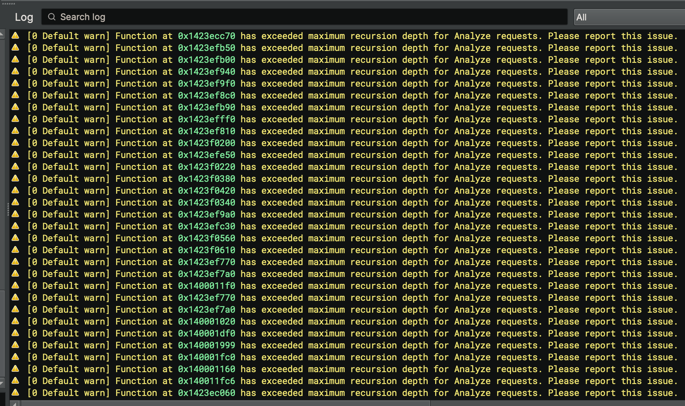

It appears that analysis puts a pause on Claude and the MCP. So, for now, let's abort analysis:

```
bv.abort_analysis()
```

This immediately speeds up Claude analysis. This time I'm less choosy about using its hints to guide me. 

Claude analysis:
```
Challenge Type: Multi-Stage Reverse Engineering with Custom Cryptography

  Primary Goal:

  The challenge requires you to provide correct input that passes through multiple cryptographic validation stages
  embedded in a custom HNTH data format.

  How It Works:

  1. Runtime Decoding:
    - At startup, xor_decoder_init decodes embedded data using key 0xc0dec475
    - This reveals a hidden data structure in "HNTH" format (magic: 0x42544E48)
  2. HNTH Format Structure:
    - Contains multiple entries indexed by operation IDs (0x1337, 0x1338, 0x1339, 0x133a, 0x1341, 0x1348, 0x1369, etc.)
    - Each entry likely contains: expected values, cipher seeds, or validation data
  3. Multi-Stage Validation:
    - Program reads user input from stdin
    - Processes it through multiple operations (identified by the hex IDs)
    - Uses custom_cipher_encrypt with different seeds at each stage
    - Compares results using compare_bytes against expected values
    - "APPDATA" reference suggests it may interact with files or environment
  4. The Custom Cipher:
    - Complex algorithm using bit rotations, XOR, and modulo operations
    - Seed-based, meaning different stages use different encryption parameters

  Challenge Objective:

  You need to either:
  - Option A: Provide the correct input/password that satisfies all validation stages
  - Option B: Reverse engineer the cipher and expected values to extract the flag directly from the decoded data

  Why "rust-tickler-3":

  - Part 3 of a series (earlier parts likely had simpler challenges)
  - "Tickler" refers to the intricate cipher operations manipulating bits
  - Rust binary (evident from panic handlers and memory management patterns)

  Difficulty Indicators:

  - Custom file format requiring parser understanding
  - Multi-layer XOR decoding
  - Custom cipher algorithm (not standard crypto)
  - Multiple validation checkpoints with different operation IDs
  - Random number generation adds complexity

  Bottom line: This is a sophisticated reversing challenge where understanding the custom cipher, decoding the HNTH
  format, and either providing correct input or extracting the validation data are key to solving it.

```

Cool, so it's just expanding what we already saw in the previous challenge. With annotations done, I continue the Binary Ninja analysis:

```
bv.workflow.machine.enable() 
```

Apparently Binary Ninja won't save half-completed analysis, so every time you open in the future it will need to re-analyze. So may as well get a cup of coffee and get it done now... While it's analyzing you can still review the functions that were completed. And make sure you Save your database after annotations, even while it warns you that analysis will need to be redone.

One thing weird that popped out to me were function sizes. I will typically sort functions by their size to find obvious junk ones, or hashing routines (massive amounts of math).

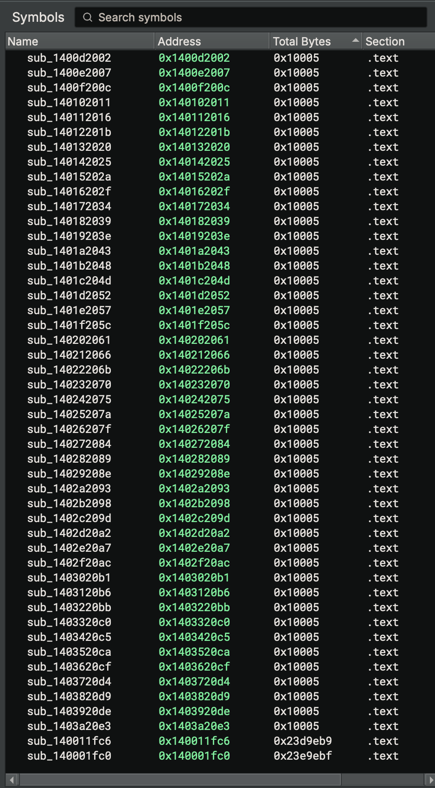

Here what I realized was dozens of functions that were all exactly 0x10005 (65,541) bytes large, and two others that were 0x23d9eb9 (37,592,761) and 0x23d9ebf (37,592,767). The math doesn't math ... and just clicking on these functions immediately freezes Binary Ninja. Attempting to view one of these during analysis just froze the app completely. Lesson learned, don't touch the forbidden functions. That is why auto analysis is taking so long. If I was a smarter person, I'd NOP those functions out... actually, why not?

NOP (0x90) is assembly code for no-op, or basically "do nothing here, just keep going".

Let's look at the file in a hex editor. There is obvious code, and then very obvious NOT code.

```
000:1370  F7 E1 48 69 C2 00 00 70 00 48 29 C7 F6 44 3C 50  ÷áHiÂ..p.H)ÇöD<P 
000:1380  01 75 30 48 8D 05 7E 85 40 02 48 89 44 24 20 48  .u0H..~…@.H‰D$ H 
000:1390  C7 44 24 28 01 00 00 00 48 C7 44 24 30 08 00 00  ÇD$(....HÇD$0... 
000:13A0  00 0F 57 C0 0F 11 44 24 38 48 8D 4C 24 20 E8 3D  ..WÀ..D$8H.L$ è= 
000:13B0  E0 3E 02 31 C0 48 81 C4 50 00 70 00 5B 5F 5E C3  à>.1ÀH.ÄP.p.[_^Ã 
000:13C0  48 83 EC 28 54 55 48 81 EC E0 16 53 00 48 89 E5  Hƒì(TUH.ìà.S.H‰å 
000:13D0  48 C7 45 00 D8 16 52 00 48 83 C5 08 C6 45 00 48  HÇE.Ø.R.HƒÅ.ÆE.H 
000:13E0  C6 45 01 4E C6 45 02 54 C6 45 03 53 C6 45 04 37  ÆE.NÆE.TÆE.SÆE.7 
000:13F0  C6 45 05 13 C6 45 06 00 C6 45 07 11 C6 45 08 A3  ÆE..ÆE..ÆE..ÆE.£ 
000:1400  C6 45 09 12 C6 45 0A 00 C6 45 0B 00 C6 45 0C B4  ÆE..ÆE..ÆE..ÆE.´ 
000:1410  C6 45 0D 01 C6 45 0E 00 C6 45 0F 00 C6 45 10 60  ÆE..ÆE..ÆE..ÆE.` 
000:1420  C6 45 11 13 C6 45 12 00 C6 45 13 00 C6 45 14 A5  ÆE..ÆE..ÆE..ÆE.¥ 
000:1430  C6 45 15 06 C6 45 16 52 C6 45 17 00 C6 45 18 D7  ÆE..ÆE.RÆE..ÆE.× 
000:1440  C6 45 19 15 C6 45 1A 52 C6 45 1B 00 C6 45 1C 7B  ÆE..ÆE.RÆE..ÆE.{ 
000:1450  C6 45 1D 13 C6 45 1E 00 C6 45 1F 00 C6 45 20 FD  ÆE..ÆE..ÆE..ÆE ý 
000:1460  C6 45 21 05 C6 45 22 52 C6 45 23 00 C6 45 24 B3  ÆE!.ÆE"RÆE#.ÆE$³ 
000:1470  C6 45 25 16 C6 45 26 52 C6 45 27 00 C6 45 28 45  ÆE%.ÆE&RÆE'.ÆE(E 
000:1480  C6 45 29 13 C6 45 2A 00 C6 45 2B 00 C6 45 2C 63  ÆE).ÆE*.ÆE+.ÆE,c 
000:1490  C6 45 2D 12 C6 45 2E 00 C6 45 2F 00 C6 45 30 01  ÆE-.ÆE..ÆE/.ÆE0. 
000:14A0  C6 45 31 01 C6 45 32 00 C6 45 33 00 C6 45 34 1E  ÆE1.ÆE2.ÆE3.ÆE4. 
000:14B0  C6 45 35 13 C6 45 36 00 C6 45 37 00 C6 45 38 8A  ÆE5.ÆE6.ÆE7.ÆE8Š 
000:14C0  C6 45 39 06 C6 45 3A 52 C6 45 3B 00 C6 45 3C 85  ÆE9.ÆE:RÆE;.ÆE<… 
000:14D0  C6 45 3D 15 C6 45 3E 52 C6 45 3F 00 C6 45 40 09  ÆE=.ÆE>RÆE?.ÆE@. 
000:14E0  C6 45 41 13 C6 45 42 00 C6 45 43 00 C6 45 44 79  ÆEA.ÆEB.ÆEC.ÆEDy 
000:14F0  C6 45 45 12 C6 45 46 00 C6 45 47 00 C6 45 48 6D  ÆEE.ÆEF.ÆEG.ÆEHm 
000:1500  C6 45 49 01 C6 45 4A 00 C6 45 4B 00 C6 45 4C 13  ÆEI.ÆEJ.ÆEK.ÆEL. 
000:1510  C6 45 4D 13 C6 45 4E 00 C6 45 4F 00 C6 45 50 37  ÆEM.ÆEN.ÆEO.ÆEP7 
000:1520  C6 45 51 12 C6 45 52 00 C6 45 53 00 C6 45 54 11  ÆEQ.ÆER.ÆES.ÆET. 
000:1530  C6 45 55 01 C6 45 56 00 C6 45 57 00 C6 45 58 73  ÆEU.ÆEV.ÆEW.ÆEXs 
000:1540  C6 45 59 13 C6 45 5A 00 C6 45 5B 00 C6 45 5C FC  ÆEY.ÆEZ.ÆE[.ÆE\ü 
000:1550  C6 45 5D 05 C6 45 5E 52 C6 45 5F 00 C6 45 60 92  ÆE].ÆE^RÆE_.ÆE`’ 
000:1560  C6 45 61 16 C6 45 62 52 C6 45 63 00 C6 45 64 45  ÆEa.ÆEbRÆEc.ÆEdE 
000:1570  C6 45 65 13 C6 45 66 00 C6 45 67 00 C6 45 68 F5  ÆEe.ÆEf.ÆEg.ÆEhõ 
000:1580  C6 45 69 12 C6 45 6A 00 C6 45 6B 00 C6 45 6C B4  ÆEi.ÆEj.ÆEk.ÆEl´ 
000:1590  C6 45 6D 15 C6 45 6E 52 C6 45 6F 00 C6 45 70 3A  ÆEm.ÆEnRÆEo.ÆEp: 
000:15A0  C6 45 71 07 C6 45 72 52 C6 45 73 00 C6 45 74 27  ÆEq.ÆErRÆEs.ÆEt' 
000:15B0  C6 45 75 05 C6 45 76 52 C6 45 77 00 C6 45 78 5D  ÆEu.ÆEvRÆEw.ÆEx] 
000:15C0  C6 45 79 16 C6 45 7A 52 C6 45 7B 00 C6 45 7C 7B  ÆEy.ÆEzRÆE{.ÆE|{ 
000:15D0  C6 45 7D 13 C6 45 7E 00 C6 45 7F 00 C6 85 80 00  ÆE}.ÆE~.ÆE..Æ…€. 
000:15E0  00 00 EF C6 85 81 00 00 00 13 C6 85 82 00 00 00  ..ïÆ….....Æ…‚... 
000:15F0  00 C6 85 83 00 00 00 00 C6 85 84 00 00 00 CB C6  .Æ…ƒ....Æ…„...ËÆ 
000:1600  85 85 00 00 00 00 C6 85 86 00 00 00 00 C6 85 87  ……....Æ…†....Æ…‡ 

```
Alllll junk code. Go to BN and set disassembly view for address, opcodes, and scroll down to that section while trying to avoid the forbidden code. We want to find the forbidden function prologue and NOP it out. 

Let's orient ourselves. The code base starts at virtual address (VA) 0x140001000, which is the start of the .text section relative to the image base 0x140000000. main() is at VA 0x1400011f0, giving it an RVA of 0x11F0. I can grab the opcode bytes at that RVA and map them to the corresponding file offset for patching.


```
000:05E0  4C 40 02 CC CC CC CC CC CC CC CC CC CC CC CC CC  L@.ÌÌÌÌÌÌÌÌÌÌÌÌÌ 
000:05F0  41 57 41 56 41 55 41 54 56 57 55 53 48 81 EC 48  AWAVAUATVWUSH.ìH 
000:0600  02 00 00 8B 05 DF FE 40 02 83 F8 03 0F 85 DA 0B  ...‹.ßþ@.ƒø..…Ú. 
```

Perfect. "415741564155415456575553" is located at 0x5F0, and you can see the byte padding before it (0xCC) letting us know this is really likely the start of something new. 

So any code in disassembly will need its address subtracted by 0x140000C00 to find the file offset of the same code. If the big function starts at 0x140001FC0, that's file offset 0x13C0. If you look at the data blob above, that it just prior to all the junk code. Nice. So, NOP first 8 bytes just to prevent analysis by replacing them with 0x90s. 

That's if you like to work simultaneously on disk and in memory, like I do. You can also just patch it directly in Binary Ninja :) Patch the bytes, right click on the function and 'Undefine function', and wait about 60 seconds ... and it's gone! After it are a few dozen functions that were all 0x1005 in size. All junk. Let's nuke them. In my symbol view, these are all lined up sequentially by address. Perfect, so I can nuke the entire block all at once! This is easiest done on disk.

The first function starts at 0x140011fc6 and the first non-junk function starts at 0x1423ebe80. Apply math, and that is file offsets 0x113C6 through 0x23EB280. Wow. I verified that this all looks like junk in 010 Editor, stepped a few bytes prior to the good function, and overwrote 0x113C6 through 0x23EB270 with 0x90s. But, while I'm at it, why not nuke the earlier one too?

Quick script to read all data in, replace the specific bytes, then write it all back out.
```
with open("rust-tickler-3.exe", "rb") as f:
    data = bytearray(f.read())
for i in range(0x13C0, 0x23EB270):
    data[i] = 0x90
with open("rust-tickler-3_patched.exe", "wb") as f:
    f.write(data)
```

Modify the file, rename it to replace original, close Binary Ninja database, reopen it, and it'll scan the new changes.

You can also do this directly within Binary Ninja, where you specify the number of bytes to write
```
bv.write(0x140011fc6, b'\x90' * 0x240FE00)
```

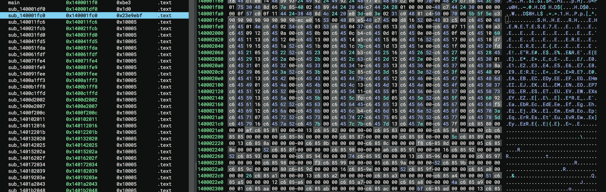

So a few different ways you could do it, and I'm sure there are much better and cleaer ways. But I wanted a permanent way just in case I need to reopen this file up in other tools.

At this point we have royally mucked with the database. So, I delete it and start over, then ask Claude to reapply all its annotations back to it.

This is a very hack-ish way to fix the problem, but it works. Now the code comes up quickly, it's easily read, and there is no junk to worry about. And instead of carrying a 90MB BNDB around, this is just 5MB. I did not do this during my analysis, but it will make your life much easier.


Back to a function analysis, I look at main() and see the staging just like the previous challenge:

```
  int64_t main()

  if (data_1424110e8 == 3)
      int64_t* rdx_1 = data_1424110e0
      void* const var_200
      parse_hnth_format(&var_200, &rdx_1[1], *rdx_1)
      
      if (not(add_overflow(0, neg.q(var_200))))
          int128_t var_218 = var_200.o
          find_and_parse_entry(&var_200, &var_218, 0x1337)
          
          if (var_200 != -0x8000000000000000)
              int64_t i_5
              int64_t i_7 = i_5
              int128_t var_258 = var_200.o
              int128_t* var_238 = &var_258
              void* const var_230_1 = &data_1400011d0
              var_200 = &data_14240a478
              int64_t var_1f8_1 = 2
              int64_t var_1e0_1 = 0
              int128_t** var_1f0 = &var_238
              int64_t var_1e8_1 = 1
              print_formatted(&var_200)
              int64_t rdx_4 = var_258.q
              
              if (rdx_4 != 0)
                  deallocate_memory(var_258:8.q, rdx_4, 1)
              
              int64_t var_140 = 0
              char* var_138_1 = 1
              int64_t var_130_1 = 0
              read_stdin()
              var_200 = &data_1424110f8
              char rax_3
              void* rdx_6
              rax_3, rdx_6 = read_line_stdin(&var_200, &var_140)
              
              if ((rax_3 & 1) == 0)
                  void* rax_4 = find_entry_by_id(&var_218, 0x133a)
                  
                  if (rax_4 != 0)
```

Previously we knew that an HNTS data structure was decrypted, restructured, and passed into string decrypting routines with specific lookup IDs. Then reading input and compare. We see the same string lookup here, but with lookups like 0x1337 and 0x133a. The data restructuring routine looks basically identical to that of Rust Tickler 2. The string decryption looks very similar except for a different bitwise algorithm:

```
  do
      int32_t rcx_4 = not.d(rax_3)
      int32_t r9_3 = rol.d(rcx_4, 4) | 1
      rcx_4.b &= 0xf
      uint64_t rax_4 = rax_3 u>> rcx_4.b
      int32_t r9_4 = r9_3 + ((ror.d(rax_3, rax_3.b) & 0xfffffffc) + 1) * rax_3
      rbx[rdx_1] ^= (r9_4 u>> (rax_4.b - (((rax_4 * 0xaaaaaaab) u>> 0x24).d << 3 * 3).b)).b
      rax_3 = r9_4
      rdx_1 += 1
  while (rdi != rdx_1)
```

And that Claude thinks the string decryption routine is an exception handler :D Obviously, AI was wrong. Remember kids, don't trust AI. 

```
  int64_t panic_handler(void* arg1, int64_t* arg2)

  // Rust panic handler - called when program encounters unrecoverable error
  int64_t rdi = *(arg1 + 0x10)

```

With a basic static analysis done, let's throw it in a VM and run it to see what happens. Same method applies. Run in TTD, make a guess, and save results. Re-run as TTD and set a few BPs to see where it lands.

Another challenge, and another attempt at a response. 

What is my favorite sha256 hash?


This time I can just verify my assumptions. Instead of a HNTS, there is an HNTB header that is being parsed apart.
(Claude said it was "HNTH"? WTF Claude) This time the table appears to be 0x5216DB (5,379,803) bytes. Yikes.


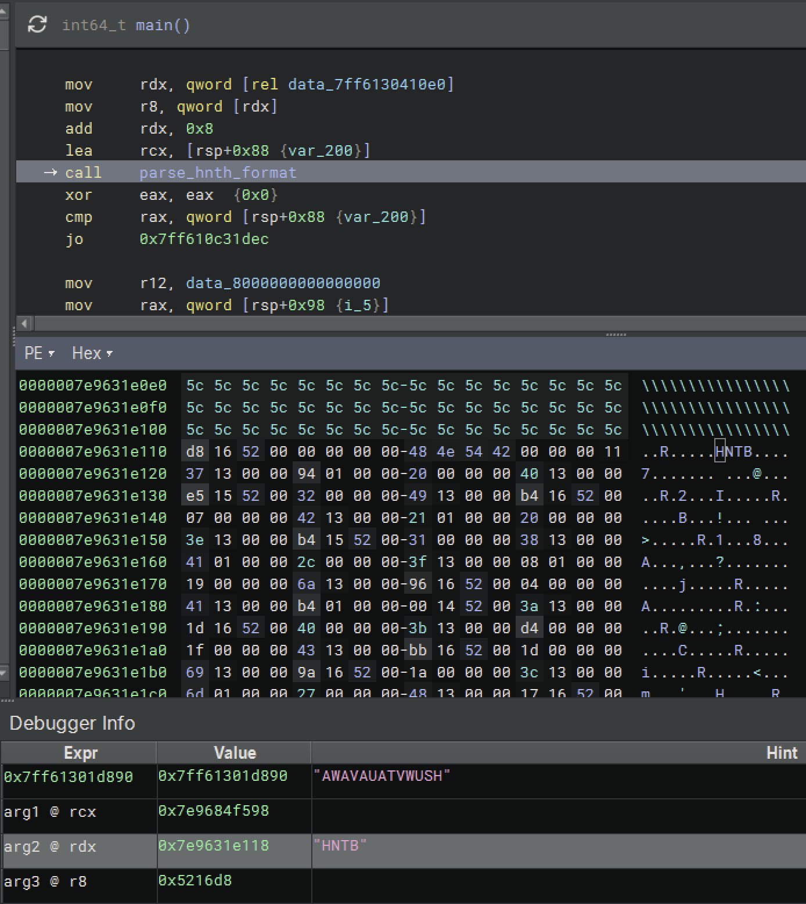

Again, I see it decrypting with a very similar FPU/SIMD output in xmm registers:

xmm0: 0x2226730de100000000000000020
xmm1: 0x726f76616620796d2073692074616857 'What is my favor'
xmm2: 0x3f687361682036353261687320657469 'ite sha256 hash?'

Again, xmm0 is split in half with the size in the low half (or is it high? I don't want to research x64 endianness right now).

So, 0x1337 = "What is my favorite sha256 hash?"

Let's skip and go straight to static string decryption.

```
if (rax_2 != 0)
  rbx = rax_2
  memcpy(dest: rax_2, src: r12_1, count: rdi.d)
  int32_t rax_3 = *(arg1 + 0x18)
  int64_t rdx_1 = 0
  
  do
      int32_t rcx_4 = not.d(rax_3)
      int32_t r9_3 = rol.d(rcx_4, 4) | 1
      rcx_4.b &= 0xf
      uint64_t rax_4 = zx.q(rax_3 u>> rcx_4.b)
      int32_t r9_4 = r9_3 + ((ror.d(rax_3, rax_3.b) & 0xfffffffc) + 1) * rax_3
      rbx[rdx_1] ^=
          (r9_4 u>> (rax_4.b - (zx.q(((rax_4 * 0xaaaaaaab) u>> 0x24).d << 3) * 3).b)).b
      rax_3 = r9_4
      rdx_1 += 1
  while (rdi != rdx_1)
```

Bit-wise math is much more difficult to reimplement in Python, which has no native functions for things like rotations. So you have to write helpers for that. Eventually it works... but I have to stop because one produces a massive blob of data.

```
$ python decrypt_all.py
Parsed 17 entries from HNTB.dat

ID 0x1337: What is my favorite sha256 hash?
ID 0x1338: Wrong, that's not my favorite sha256 hash...
ID 0x1339: Thank you, Bingus! But our princess is in another castle!
ID 0x133a: a4ec6d39192922bdec0e310db3dda25f21f1d7e8e9e68cfebc156553e4123b03
ID 0x133b: Crab tickler 2! Rust RE is fun!
ID 0x133c: You are going to find the flag in here?
ID 0x133d: The flag is not here!
ID 0x133e: The flag is the hash of the name of a certain cat
ID 0x133f: Follow the Gray Rabbit...
ID 0x1340: These are practically the same red herring strings
ID 0x1341: [text: 3068657 bytes] (,nc5d395929bdc0e)
ID 0x1342: Reality is soup and I AM A FORK!
ID 0x1343: I am totally a purple herrin
ID 0x1348: Exodus
ID 0x1349: APPDATA
ID 0x1369: rust-tickler-3-stage-2.exe
ID 0x136a: .txt
```

W00t!

<div align="center"><a href="http://www.youtube.com/watch?feature=player_embedded&v=I0WzT0OJ-E0" target="_blank"><br>Spiritbox - Circle With Me</a></div>

So an apparent flag, but also much more to this. Skipping flag check, let's find 0x1341 in code.

Checking code refs, I see 5 calls to check strings but none with this 0x1341.

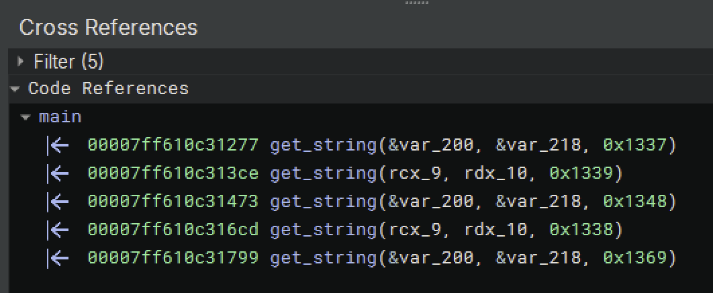

Check for:
```
0x1337: What is my favorite sha256 hash?
0x1339: Thank you, Bingus! But our princess is in another castle!
0x1348: Exodus
0x1338: Wrong, that's not my favorite sha256 hash...
0x1369: rust-tickler-3-stage-2.exe
```

Here's where I realize there is a second routine to get a string, which I'm calling get_string_2(). I see it at the input check and it's also my 0x1341 for later.

It checks:
```
0x133a: a4ec6d39192922bdec0e310db3dda25f21f1d7e8e9e68cfebc156553e4123b03
0x1341: ",nc5d395929bdc0e" ... 
```

Oh wait, look at that. Line them up and there's overlap. Which would likely be NULLs if one is an XOR key to the other. Almost...

Maybe I can abandon this file completely and just focus on the embedded strings?

```
>>> import malduck
>>> key = b'a4ec6d39192922bdec0e310db3dda25f21f1d7e8e9e68cfebc156553e4123b03'
>>> data = open('0x1341.dat', 'rb').read()
>>> output = malduck.xor(data, key)
>>> output[0:32]
b'MZ\x06VRW\n\x0c\x08\x0b\x0b[VQR\x01'
```

No. There's more to the routine.


I look further in main() to see a function that Claude thought was decryption, and it's right after a CloseHandle(). Promising...

```
  var_1f8_3 = &data_2
  var_1e0_3 = 0
  int128_t** var_1f0_4 = &var_238
  int64_t var_1e8_5 = 2
  int64_t var_a8
  sub_7ff613034480(&var_a8, &rust_tickler_filename)
  sub_7ff61301e040(&var_258:8)
  
  if (var_248_2 != 0)
      deallocate_memory(var_258:8.q, var_248_2, 1)
  
  CloseHandle(hObject: var_258.q)
  int64_t rax_18 = var_a8
  int64_t var_d0
  custom_cipher_encrypt(&var_d0, 
      *(decoded_data + 0x18), 
      *(decoded_data + 8), 
      *(decoded_data + 0x10))
  char* var_c8
  char* r14_4 = var_c8
  int64_t var_c0
  int64_t r9_4

```

Oh, inside this is just another byte decryption routine:

```
  do
      int32_t rcx_4 = not.d(rbx_1)
      int32_t r8_3 = rol.d(rcx_4, 4) | 1
      rcx_4.b &= 0xf
      uint64_t rbx_2 = zx.q(rbx_1 u>> rcx_4.b)
      int32_t r8_4 = r8_3 + ((ror.d(rbx_1, rbx_1.b) & 0xfffffffc) + 1) * rbx_1
      rax_2[rax_3] ^=
          (r8_4 u>> (rbx_2.b - (zx.q(((rbx_2 * 0xaaaaaaab) u>> 0x24).d << 3) * 3).b)).b
      rbx_1 = r8_4
      rax_3 += 1
  while (arg4 != rax_3)
```

So it does it twice? Meh, I'm tired. Just TTD it.

Rerun with correct flag:

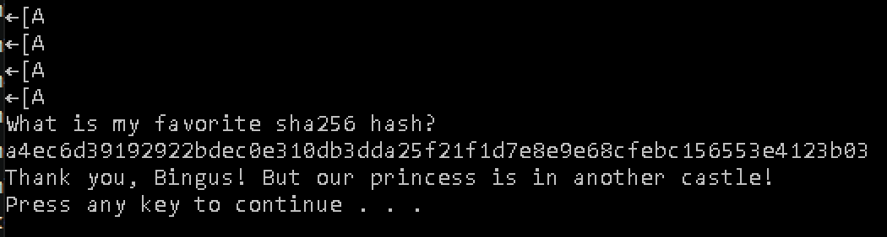

"Thank you, Bingus! But our princess is in another castle!"

Then a long delay before an actual pause.


Back to analysis, and Claude gets something wrong again :) 

```
  if (compare_bytes(rax_4, rax_5, rdx_8) == 0)
      get_string(rcx_9, rdx_10, 0x1338)
                              
```

That is NOT compare_bytes, it's another bitwise decryption routine :) 

Just skip past to the payload decryption.

Monitor XMM registers ... this is not what I expected...

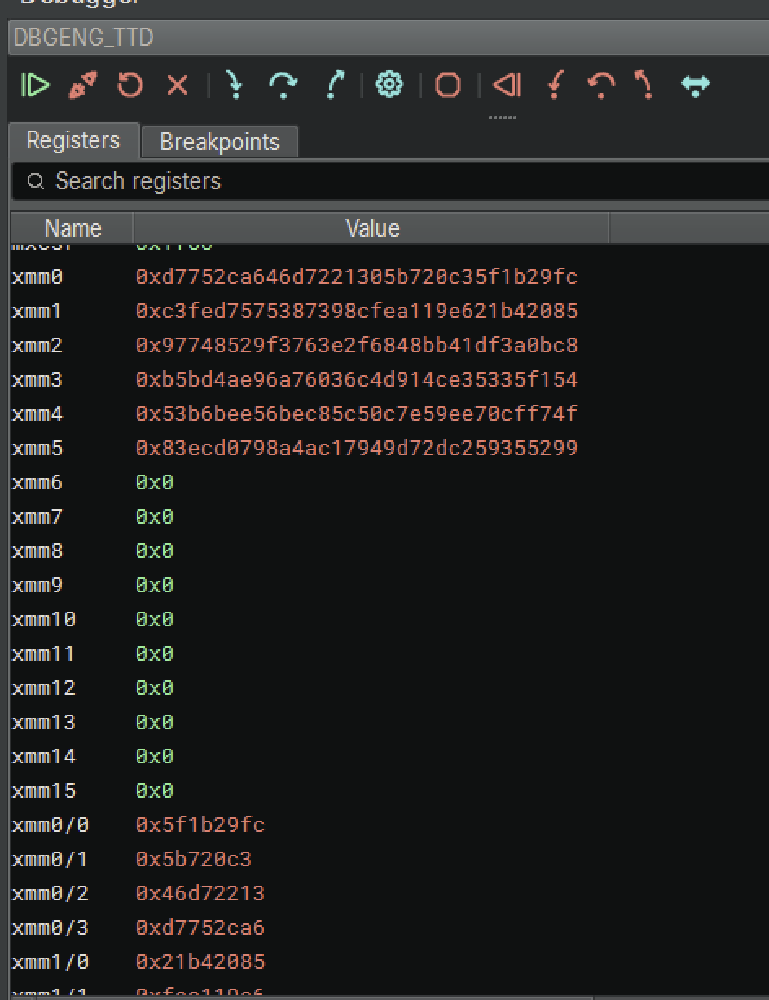

Keep following code. There's another XOR loop down below:

```
  do
      uint64_t rdx_29
      
      if ((i_2 | rdx_8) u>> 0x20 == 0)
          rdx_29 =
              zx.q(modu.dp.d(0:(i_2.d), rdx_8.d))
      else
          rdx_29 = modu.dp.q(0:i_2, rdx_8)
      
      *r14_4 ^= rax_5[rdx_29]
      int64_t r15_2
      r15_2.b = r11_1 != r9_5
      uint64_t rdx_27
      
      if (((i_2 + 1) | rdx_8) u>> 0x20 != 0)
          rdx_27 = modu.dp.q(0:(i_2 + 1), rdx_8)
      else
          rdx_27 = zx.q(modu.dp.d(
              0:((i_2 + 1).d), rdx_8.d))
      
      *r11_1 ^= rax_5[rdx_27]
      void* const r14_5
      r14_5.b = r15_2.b
      r14_4 = r14_5 + r11_1
      void* const r11_2
      r11_2.b = r14_4 != r9_5
      r11_1 = r11_2 + r14_4
      i_2 += 2
  while ((var_c0 & 0xfffffffffffffffe)
```

There it is. This is doing the final XOR to get an MZ header. A second executable.

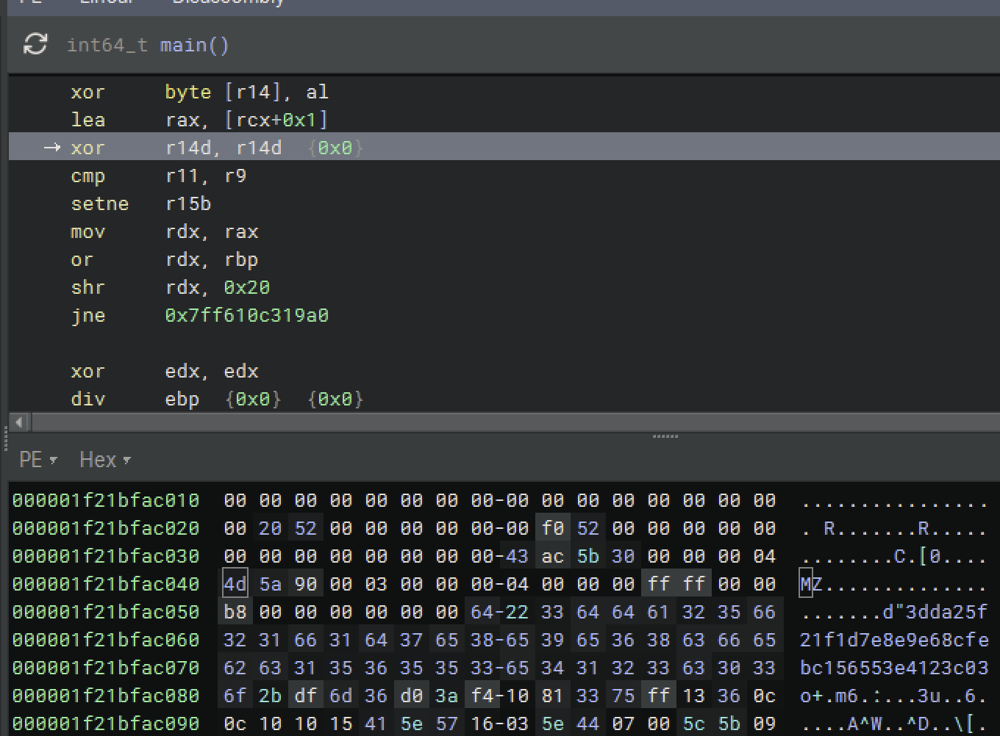

I follow along more until this is sent into a function with an NtWriteFile. However, the NtWriteFile is being called dynamically from a register. Binary Ninja / TTD does not really like this. So you get the decompiler view but not the values in the Debugger Info. No matter, I can trace the args and see that the MZ file is being written here to a file named C:\Users\Admin\AppData\Local\Temp\.tmptzXQY0.txt

Since I'm looking at data after the fact, the file is no longer there. But, we're in TTD. We have the contents as they were in memory at this time, and NtWriteFile shows a size of 0x521400 bytes. 


While staying at this timestamp, I can extract this data from this point in time from the Binary Ninja console:

```
>>> data = bv.read(0x1f21bfac040, 0x521400)
>>> data[0:16]
b'MZ\x90\x00\x03\x00\x00\x00\x04\x00\x00\x00\xff\xff\x00\x00'
>>> open('stage2.exe', 'wb').write(data)
5379072
```

The only thing left that's unusual now is the weird "Exodus" string... It came from string 0x1348. I set a BP at the get_string() call to it and realize it had already happened. So, Shift-F9 back to it.

I see Exodus being appended to APPDATA. So, file name or folder?

Let's actually try a dynamic run in Noriben to see what happens.

```
-=] Sandbox Analysis Report generated by Noriben v2.0.2
-=] https://github.com/Rurik/Noriben

-=] Analysis of command line: rust-tickler-3.exe
-=] Execution time: 8.20 seconds
-=] Processing time: 0.75 seconds
-=] Analysis time: 0.19 seconds

Processes Created:
==================
[CreateProcess] python.exe:3424 > "rust-tickler-3.exe"  [Child PID: 7896]
[CreateProcess] rust-tickler-3.exe:7896 > "cmd.exe /c pause"    [Child PID: 1336]

File Activity:
==================
[CreateFile] rust-tickler-3.exe:7896 > %Temp%\.tmpP7Gk2t
[CreateFile] rust-tickler-3.exe:7896 > %Temp%\.tmpP7Gk2t.txt
[CreateFolder] rust-tickler-3.exe:7896 > %AppData%\Exodus
[RenameFile] rust-tickler-3.exe:7896 > %Temp%\.tmpP7Gk2t.txt => %AppData%\Exodus\rust-tickler-3-stage-2.exe
```

Oh, well that makes sense now. I see the file still there in Exodus, and it's the same as I pulled from memory.

Let's scrap this first file and pivot to stage 2.

Phew, feeling it now.

<div align="center"><a href="http://www.youtube.com/watch?feature=player_embedded&v=ng8mh6JUIqY" target="_blank"><br>BABYMETAL - BxMxC</a></div>


This could have all been done within 10 minutes, but we're taking the long way around, right? We could've used a debugger to force values into the get_string() until we found the flag, which would've gotten us straight to here. But where is the fun in that?

== Stage 2 - Fight! ==


Where the first stage executable used very large functions to inhibit us, stage 2 uses thousands of small functions. And again with some large routines that are around 65,536 bytes in size. Looking at these and ... it's math.

Legit math.

```
      if (arg10 u>= 0xf4)
          arg12 = _mm512_mask_shuffle_epi8(arg11, arg12, arg18)
          uint32_t zmm0_56[0x10] =
              __vpaddd_zmmu32_maskmskw_zmmu32_memu32_avx512(arg11, arg12, data_14048b600)
          uint64_t zmm5_17[0x8] = _mm512_maskz_load_epi64(arg11, data_14048b680)
          uint32_t zmm3_61[0x10] = _mm512_maskz_add_epi32(arg11, zmm0_56, zmm5_17)
          uint32_t zmm4_34[0x10] = _mm512_maskz_add_epi32(arg11, zmm3_61, zmm5_17)
          zmm0_55 = _mm512_mask_shuffle_epi8(arg11, zmm0_56, arg18)
          zmm3_60 = _mm512_mask_shuffle_epi8(arg11, zmm3_61, arg18)
          zmm4_33 = _mm512_mask_shuffle_epi8(arg11, zmm4_34, arg18)
      else
          zmm0_55 = _mm512_maskz_add_epi32(arg11, arg12, arg17)
          zmm3_60 = _mm512_maskz_add_epi32(arg11, zmm0_55, arg16)
          zmm4_33 = _mm512_maskz_add_epi32(arg11, zmm3_60, arg16)
      
      uint64_t zmm30_37[0x8] = _mm512_broadcast_f64x2(arg11, *arg1)
      uint64_t zmm8_14[0x8] = _mm512_maskz_load_epi64(arg11, arg19)
      uint64_t zmm1_19[0x8] = _mm512_loadu_epi64(arg11, *(&__return_addr + arg5))
      arg12[0].o = _mm512_extracti32x4_epi32(arg11, zmm4_33, 3)
      zmm2 = _mm512_mask_shuffle_i64x2(arg11, arg12, arg12, 0)
      uint128_t zmm31_32[0x4] = _mm512_broadcast_f64x2(arg11, arg1[1])
      uint64_t zmm18_6[0x8] = _mm512_loadu_epi64(arg11, *(&arg_40 + arg5))
      uint64_t zmm22_19[0x8] = _mm512_maskz_load_epi64(arg11, arg20)
      uint64_t zmm0_57[0x8] = _mm512_maskz_xor_epi64(arg11, zmm0_55, zmm30_37)
      uint64_t zmm3_62[0x8] = _mm512_maskz_xor_epi64(arg11, zmm3_60, zmm30_37)
      uint64_t zmm4_35[0x8] = _mm512_maskz_xor_epi64(arg11, zmm4_33, zmm30_37)
      uint128_t zmm30_38[0x4] = _mm512_broadcast_f64x2(arg11, arg1[2])
      uint64_t zmm14_4[0x8] = _mm512_clmulepi64_epi128(zmm8_14, zmm1_19, 0x11)
      uint128_t zmm7_4[0x4] = _mm512_clmulepi64_epi128(zmm8_14, zmm1_19, 0)
      uint128_t zmm10_7[0x4] = _mm512_clmulepi64_epi128(zmm8_14, zmm1_19, 1)
      uint128_t zmm11_4[0x4] = _mm512_clmulepi64_epi128(zmm8_14, zmm1_19, 0x10)

```

That's a blues clue to some sort of hashing, or proper encryption that has whitepapers. Claude says there's crypto routines, but I also do not see any of the similar string table lookups from prior samples.

Looking at strings there are a TON of crypto-related strings. And many related to "EVP" source, like ("crypto\\evp\\evp_enc.c").

I go look and find the source for this on Github: https://github.com/openssl/openssl/blob/c8b4a397d066857492c714735d7658cd1e545e81/crypto/evp/evp_enc.c

I put that to the side for if I find any unique constants.

Reviewing main() from the beginning I start looking for any data structures.

There are three in a row that are referenced at the very beginning:
```
  if ((rax.b & 1) != 0)
      cleanup_context(rax, rdx_1)
  else
      void* rax_1 = get_cipher_context()
      var_78 = &data_14037d0f8
      int64_t var_70_1 = 0x30
      void* const var_68_1 = &data_14037d128
      int64_t var_60_1 = 0x20
      void* const var_58_1 = &data_14037d148
      int64_t var_50_1 = 0x10
      void* var_48_1 = rax_1
      void* rdx_2 = &var_140[var_138]
      void* rcx_3
      char* r8_1
      void* r9_1
```

They're also sequentially plaed within file:

```
data_14037d0f8:
                        cb 58 4b 62 03 5d 13 8f          .XKb.]..
77 bc 98 10 f0 0f 1a 20 20 70 0f 8f bf 0d 75 dc  w......  p....u.
a3 fd 71 08 5f 14 67 cd e9 d0 5f 1f 83 bb c7 6b  ..q._.g..._....k
7d 9b eb 42 f7 51 00 95                          }..B.Q..
data_14037d128:
                        d4 c3 94 86 fd f0 42 83          ......B.
f5 d9 64 36 ba 68 ea 1c 4f 41 94 79 6a f8 2d 0f  ..d6.h..OA.yj.-.
8e ed 7c 12 f5 3f a0 7c                          ..|..?.|
data_14037d148:
                        53 9f b3 1e 1c c1 34 42          S.....4B
42 0d 03 93 97 e9 17 77                          B......w
```

Tagging as unknown 1-3

Wait, I see string math

Inside 0x140001080 is:

```
1400010db            
1400010db            if (rsi != 1)
140001138                int64_t r9_1 = 0x2dc3392926f15bf1
140001142                i = 0
140001142                
14000117c                do
14000115e                    rbx[i] ^= ((r9_1 * 0x124a1419653016ec - 0x2e93c953c3021cae).d u>> 2).b
140001166                    r9_1 = (r9_1 * 0x124a1419653016ec - 0x2e93c953c3021cae)
140001166                        * 0x124a1419653016ec - 0x2e93c953c3021cae
140001170                    rbx[i + 1] ^= (r9_1.d u>> 2).b
140001175                    i += 2
14000117c                while ((0x7ffffffffffffffe & rsi) != i)
14000117c                
140001192                if ((rsi.b & 1) != 0)
140001194                    rbx[i] ^= ((r9_1.d * 0x2ec + 0x352) u>> 2).b
```

This is set right at the beginning of main() actually:
```
  BOOL main()

1400012aa    void* const var_78 = &data_14037d068
1400012b2    int64_t var_70 = 0x6c
1400012c6    void* const* var_178 = &var_78
1400012d2    int64_t (* var_170)(int64_t* arg1, int64_t* arg2) = &str_decrypt
1400012de    void* const var_130 = &data_14037d0d8
1400012e3    int64_t var_128 = 2
1400012ec    int64_t var_110 = 0
1400012fd    void* const** var_120 = &var_178
```
But doesn't seem explicitly called from there. OK, good time to start a TTD (yes, it probably would've been best to do this immediately).

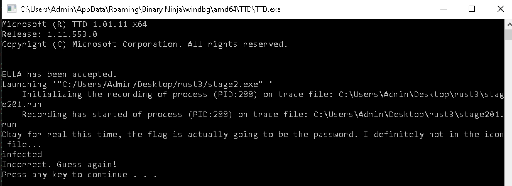


"Okay for real this time, the flag is actually going to be the password. I definitely not in the icon file..."

I would say go look at the icon file, but that is a known red herring for this competition.

Let's start with how that text prompt appears.

What? It's called by this routine in main():
```
  BOOL main()

      void* const var_78 = &data_7ff65da3d068
      int64_t var_70 = 0x6c
      void* const* var_178 = &var_78
      int64_t (* var_170)(int64_t* arg1, int64_t* arg2) = &str_decrypt
      void* const var_130 = &data_7ff65da3d0d8
      int64_t var_128 = 2
      int64_t var_110 = 0
      void* const** var_120 = &var_178
      int64_t var_118 = 1
➞      sub_7ff65d7c9300(&var_130)
      int64_t var_148 = 0
      char* var_140 = &nullptr->:1
```

Well, it is using that var_130. Maybe it's originating from the var_78 struct at the beginning? 
var+78 = rsp+0x120 = 0x72f05ff5d0

No, doesn't line up. In the first str_decrypt call it's decrypting:
```
\x90\xb5\x93\x1b\x82\xc4\xcd\xd0\x82\xd0\xc7\xc3\xce\x82\xd6\xca
```
That decrypts to
```
Okay for real this time, the flag is actually going to be the password. I definitely not in the icon file...
```

That lines up to a data structure at the beginning:

```
str_prompt:
                        90 b5 93 1b 82 c4 cd d0          ........
82 d0 c7 c3 ce 82 d6 ca cb d1 82 d6 cb cf c7 8e  ................
82 d6 ca c7 82 c4 ce c3 c5 82 cb d1 82 c3 c1 d6  ................
d7 c3 ce ce db 82 c5 cd cb cc c5 82 d6 cd 82 c0  ................
c7 82 d6 ca c7 82 d2 c3 d1 d1 d5 cd d0 c6 8c 82  ................
eb 82 c6 c7 c4 cb cc cb d6 c7 ce db 82 cc cd d6  ................
82 cb cc 82 d6 ca c7 82 cb c1 cd cc 82 c4 cb ce  ................
c7 8c 8c 8c 0a 00 00 00                          ........
```

But the memory addresses are moved around so much you can't get a good lock on it for tracking. And, this string decrypt is never called again? What?

... There are different string decrypts. Right before each reference of one of these values is a new math routine loaded into memory for execution.

```
data_7ff65da3d158:
                        99 1f 84 9a 7a a2 d8 8e          ....z...
4c fa 0c a6 31 c5 6b 95 4e 4c 3e 9a c5 e2 11     L...1.k.NL>....
```
That is "Incorrect. Guess again!"

So let's go up for a check right before that:
```
➞          if (compare_strings_wrapper(&var_78, &var_130) == 0)
              var_178 = &data_7ff65da3d158
              int64_t var_170_2 = 0x17
              void* const var_168_2 = &data_7ff65da3d16f
              int64_t var_160_2 = 0x17
➞          else
              var_178 = &data_7ff65da3d186
              int64_t var_170_1 = 0x23
              void* const var_168_1 = &data_7ff65da3d1a9
              int64_t var_160_1 = 0x23
          
          void* const** var_158 = &var_178
          int32_t (* var_150_1)(int64_t* arg1, int64_t* arg2) = str_dec_incorrect
          var_130 = &str_incorrect

```

Going into compare_strings_wrapper() is my guess "infected" and a ptr to data_14037d0f8, the "CB ..." value I called unknown1.

That immediately leads to another function that breaks apart the unknown1 and sends it in pieces to a new routine:
  
```
uint64_t compare_strings_wrapper(int64_t* arg1, int128_t* arg2)

      return validate_and_decrypt(&arg1[6], *arg1, arg1[1], arg1[2], *(arg1 + 0x18), arg1[5], *arg2)
```

Here there be a black hole. Lots of subroutines, lots of code, lots of unknown. And some cool stuff like this:

```
      do
          uint16_t rcx_1 = (rcx u>> 0x10).w
          uint16_t rdx_1 = (rdx u>> 0x10).w
          uint16_t rbx_1 = (rbx u>> 0x10).w
          arg6 = &arg6[4]
          uint16_t rax_1 = (rax u>> 0x10).w
          int32_t r8_3 = *(arg5 + (zx.q(rdx.b) << 3)) ^ *(arg5 + (zx.q(rax:1.b) << 3) + 3)
              ^ *(arg5 + (zx.q(rbx_1.b) << 3) + 2)
          rax = *arg6 ^ *(arg5 + (zx.q(rax.b) << 3)) ^ *(arg5 + (zx.q(rbx:1.b) << 3) + 3)
              ^ *(arg5 + (zx.q(rcx_1.b) << 3) + 2) ^ *(arg5 + (zx.q(rdx_1:1.b) << 3) + 1)
          rbx = arg6[1] ^ *(arg5 + (zx.q(rbx.b) << 3)) ^ *(arg5 + (zx.q(rcx:1.b) << 3) + 3)
              ^ *(arg5 + (zx.q(rdx_1.b) << 3) + 2) ^ *(arg5 + (zx.q(rax_1:1.b) << 3) + 1)
          rcx = arg6[2] ^ *(arg5 + (zx.q(rcx.b) << 3)) ^ *(arg5 + (zx.q(rdx:1.b) << 3) + 3)
              ^ *(arg5 + (zx.q(rax_1.b) << 3) + 2) ^ *(arg5 + (zx.q(rbx_1:1.b) << 3) + 1)
          rdx = arg6[3] ^ r8_3 ^ *(arg5 + (zx.q(rcx_1:1.b) << 3) + 1)
          i = i_1
          i_1 -= 1
      while (i != 1)
      uint16_t rcx_3 = (rcx u>> 0x10).w
      uint16_t rdx_3 = (rdx u>> 0x10).w
      uint16_t rbx_3 = (rbx u>> 0x10).w
      uint16_t rax_3 = (rax u>> 0x10).w
      int32_t r10_7 = zx.d(*(arg5 + (zx.q(rax.b) << 3) + 2))
          ^ (*(arg5 + (zx.q(rbx:1.b) << 3)) & 0xff00) ^ (*(arg5 + (zx.q(rcx_3.b) << 3)) & 0xff0000)
      zx.d(*(arg5 + (zx.q(rbx.b) << 3) + 2)) ^ (*(arg5 + (zx.q(rcx:1.b) << 3)) & 0xff00)
          ^ (*(arg5 + (zx.q(rdx_3.b) << 3)) & 0xff0000)
      zx.d(*(arg5 + (zx.q(rcx.b) << 3) + 2)) ^ (*(arg5 + (zx.q(rdx:1.b) << 3)) & 0xff00)
          ^ (*(arg5 + (zx.q(rax_3.b) << 3)) & 0xff0000)
      zx.d(*(arg5 + (zx.q(rdx.b) << 3) + 2)) ^ (*(arg5 + (zx.q(rax:1.b) << 3)) & 0xff00)
          ^ (*(arg5 + (zx.q(rbx_3.b) << 3)) & 0xff0000)
```

One of these rabbit holes led me to this:
```
  if (arg1[2].d != 0)
      void* rax_1 = *arg1
      
      if (rax_1 == 0)
          sub_7ff65d80aa30()
          sub_7ff65d80acb0(6, 0x83, nullptr, 
              sub_7ff65d80ab50("crypto\evp\evp_enc.c", 0x3e6, "EVP_EncryptUpdate"))
      else if (*(rax_1 + 0x70) != 0)
          int64_t rsi_1 = *(rax_1 + 0x98)
          int32_t rdx
          
          if (rsi_1 != 0)
              rdx = *(rax_1 + 4)
          
          if (rsi_1 == 0 || rdx s< 1)
              sub_7ff65d80aa30()
              sub_7ff65d80acb0(6, 0xbd, nullptr, 
                  sub_7ff65d80ab50("crypto\evp\evp_enc.c", 0x3f0, "EVP_EncryptUpdate"))
          else
              if (rdx == 1)
                  rdx = 0
              
              int32_t rax_3 = rsi_1(arg1[0x16], arg2, &arg_8, sx.q(rdx) + r8, arg4, r8)
              
              if (rax_3 == 0)
                  rbx_1 = rax_3
              else
                  int64_t rcx_1 = arg_8
```

Then I remembered the EVP code I tabled at the start. Was this EVP_EncryptUpdate? It's hard to compare, but arg count and types looked right? I renamed it and the args anyway and worked backwards to its caller.

```
  int64_t* weird3(int64_t* arg1, int64_t* ctx, int64_t in, int64_t inl, int64_t out, int64_t arg6)

      if (out == 0)
      label_7ff65d6c2ef1:
          
          if (inl u<= 0x7fffffff)
              int32_t outl = 0
              int64_t r12_2
              
              if (EVP_EncryptUpdate(ctx, out, &outl, in, inl.d) s<= 0)

```
I compared and the argument count and type matched ... so maybe this weird3 is EVP_CipherUpdate? No, arguments aren't exactly right. But I'm seeing a trend.

Now, I'll pause right here and admit something. I was tired and AI threw me off. I saw big math, I thought hashing, Claude said it was MD5. So I tried to figure out an MD5 to match these values. When I questioned Claude, it praised me for my thinking and said it was SHA256 instead. When that didn't work, Claude complimented my keen eye and said it was MD5... I wasted hours going down the wrong route here.

So back to identifying copied code. I started looking for one-off strings used in EVP, comparing those functions to the functions in the sample, and found most are very similar if not identical.

EVP_CIPHER_CTX_set_key_length() with keylen started my real chain. That led me up to the get_string(). I searched github for code using EVP_CIPHER_CTX_set_key_length() (not just declaring it). I'm realizing that this is the entire OpenSSL library statically compiled in. I need to stay as close to the surface as possible.

And then I saw it:

https://github.com/openssl/openssl/blob/c8b4a397d066857492c714735d7658cd1e545e81/crypto/evp/evp_enc.c#L633C1-L639C2:
```
int EVP_CipherInit_ex2(EVP_CIPHER_CTX *ctx, const EVP_CIPHER *cipher,
                       const unsigned char *key, const unsigned char *iv,
                       int enc, const OSSL_PARAM params[])
{
    return evp_cipher_init_internal(ctx, cipher, NULL, key, iv, enc, 0, params);
}
```

When I first did this I accidentally landed on the right place. In doing this write-up, of course, I did not. So, I'll give the shortcut: Ask AI.

I provided Claude my Binary Ninja MCP, the URL to env_enc.c, and told it to rename functions that match. This actually takes you right to the answer that required me to spend another half an hour on my own.

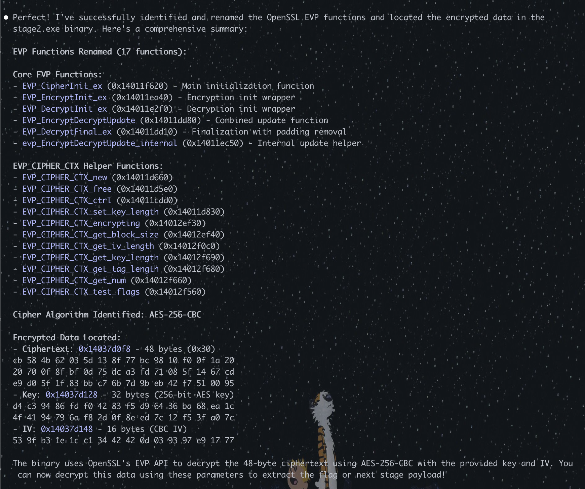

But, the TTD never got there. I sat and stared for a bit and then re-read the question:

```
Okay for real this time, the flag is actually going to be the password. I definitely not in the icon file...
```

The flag is the password. I needed to type in the flag, so it probably had a length check that I missed.

flag{gimmeflagplzkthxbaiohhimarklulz!}

Yup, now I remembered that it failed earlier when I first tried that function. Length matters. Now, tracing led me here:

```
  int64_t sub_7ff65d7dea80(int64_t* arg1, int32_t* arg2, int64_t arg3, void* arg4, int64_t* arg5)
      __chkstk(0x48)
      return evp_cipher_init_internal(arg1, arg2, nullptr, arg3, arg4, 1, 0, arg5)
```

Rename the variables for the call to clean it up.

Finally, right here, it all hit. Debugger info shows the values going in, which all aligned to things I had marked up and knew. 

Note: If your Debugger info still shows arg1, arg2, that's because you have to rename them from within the function, not rename the variables as they go in.

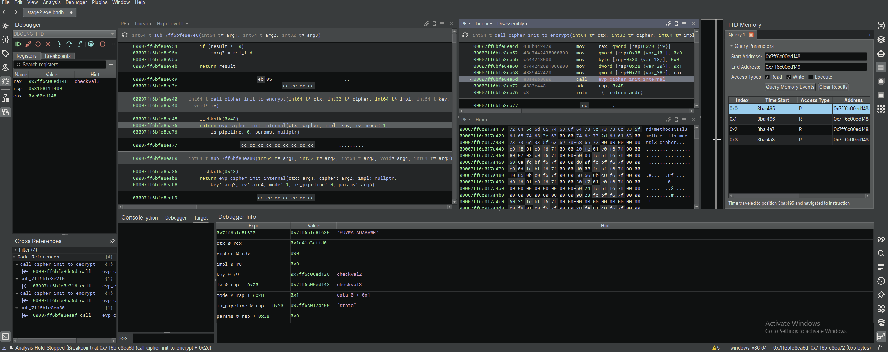

With that set, I just did a simple decrypt of the values in front of me.


```
>>> import malduck
>>> data = b"\xcbXKb\x03]\x13\x8fw\xbc\x98\x10\xf0\x0f\x1a  p\x0f\x8f\xbf\ru\xdc\xa3\xfdq\x08_\x14g\xcd\xe9\xd0_\x1f\x83\xbb\xc7k}\x9b\xebB\xf7Q\x00\x95"
>>> key = b"\xd4\xc3\x94\x86\xfd\xf0B\x83\xf5\xd9d6\xbah\xea\x1cOA\x94yj\xf8-\x0f\x8e\xed|\x12\xf5?\xa0|"
>>> iv = b"S\x9f\xb3\x1e\x1c\xc14BB\r\x03\x93\x97\xe9\x17w"
>>> malduck.aes.cbc.decrypt(key, iv, data)
b'flag{fb8de641f383151222845d9b991a17c2}\n\n\n\n\n\n\n\n\n\n'
```
flag{fb8de641f383151222845d9b991a17c2}

Rerun TTD to see what happens:

With the correct key we can see it properly function. Actually, it was doing this before, we just didn't monitor it.

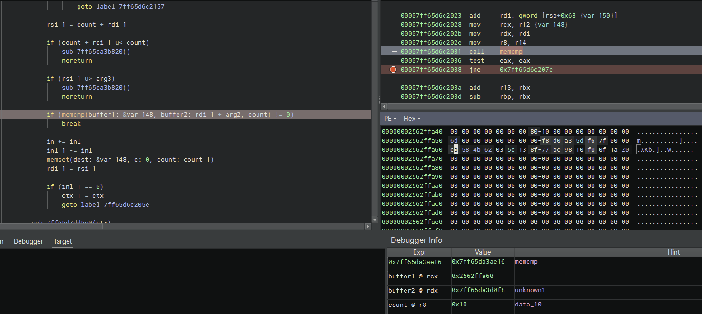

It appears to be encrypting your flag with the preset key in 16-byte blocks to check if the encrypted value of the flag matches the encrypted payload.

Clever. There is no decryption in the routine, only encryption.

One more appropriate song to close it out.

<div align="center"><a href="http://www.youtube.com/watch?feature=player_embedded&v=D1NdGBldg3w" target="_blank"><br>Electric Callboy - WE GOT THE MOVES</a></div>
