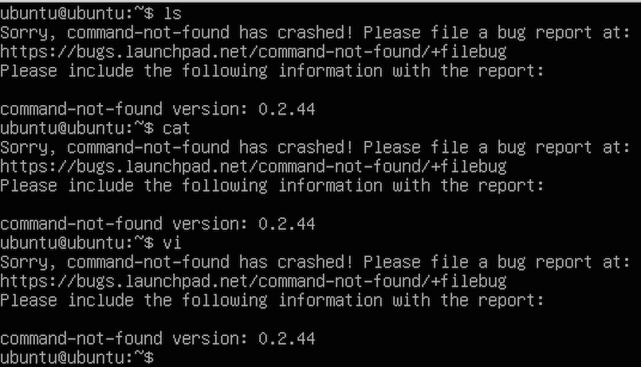
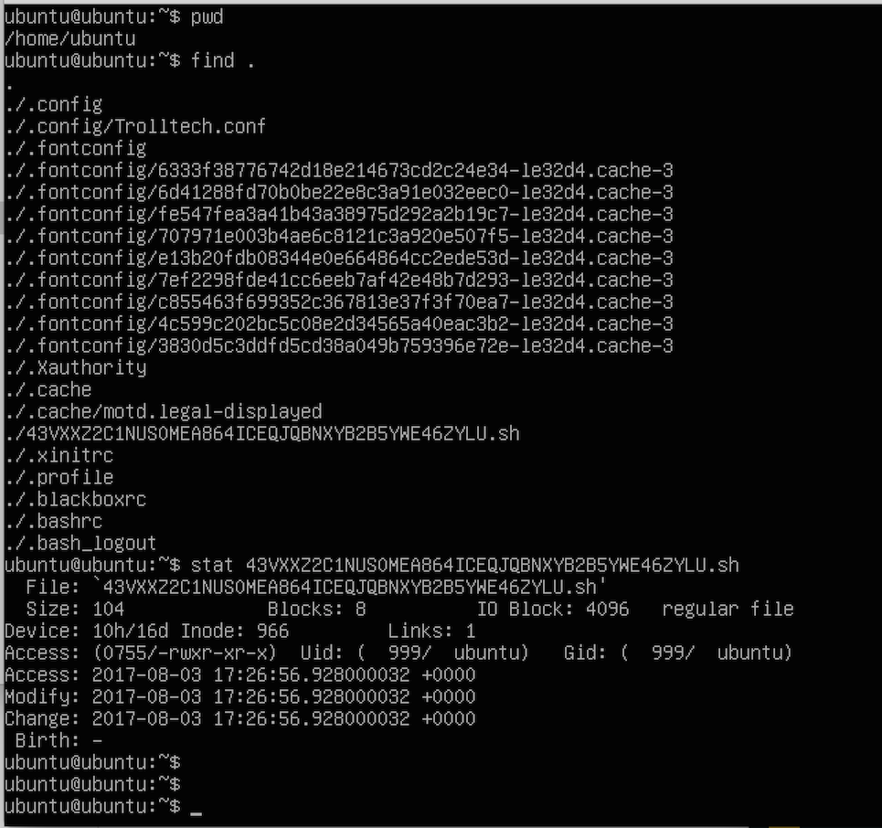
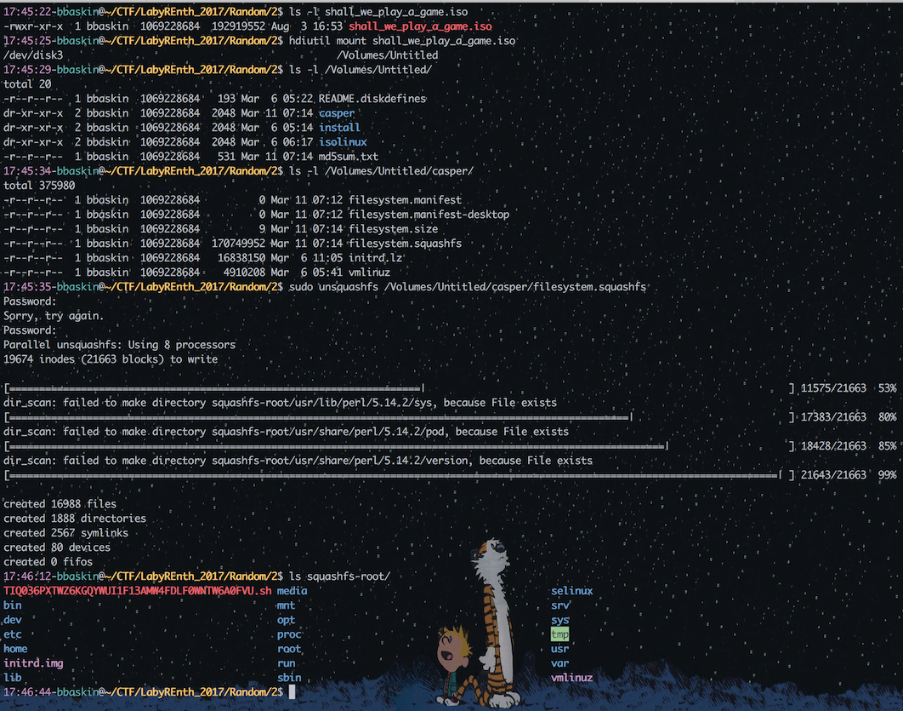
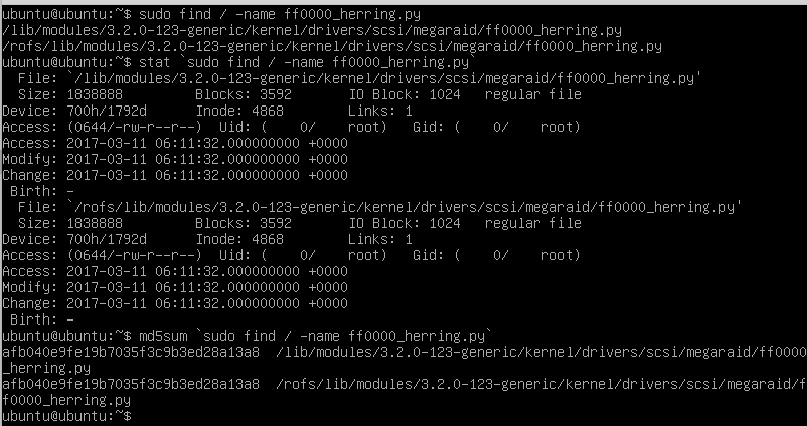
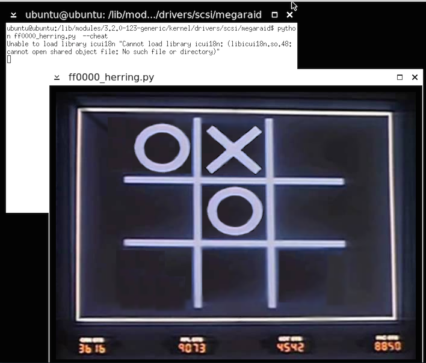
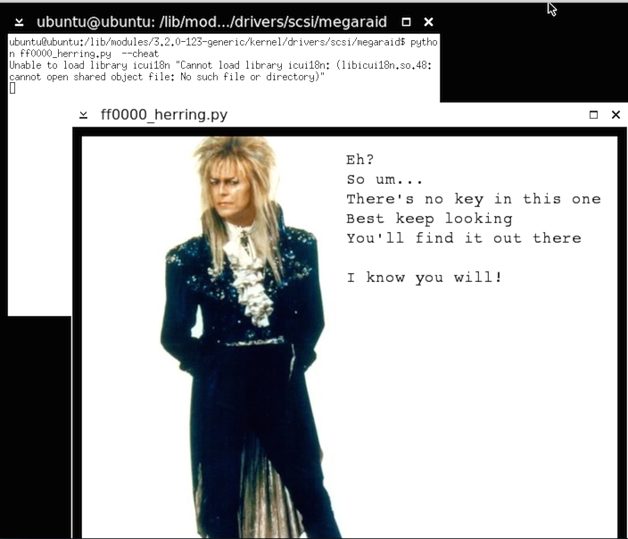

# Random #2 - Rainbow

This challenge was a 184MB ISO image downloaded over Bittorrent. First things first, load up a VM, attach the ISO, and boot from it. You'll immediately given the WarGames "Let's play a game", followed by a graphical version of Tic-Tac-Toe. OK, slightly off the Labyrinth theme, but I'll play along.


Losing the game ultimately ends up in an image of a nuclear bomb blast. I broke out various Tic-Tac-Toe strategy guides but, no matter how I played, the computer would always win. Bugger.

Since the ISO boots straight into the X GUI, I jumped to console (ctrl-alt-F2) to poke around the filesystem. I was then presented with the first hurdle: almost all of the Linux commands were removed. All the basics: ls, cat, grep, etc, were all gone. Oh well. I've had worse (queue story of HackFortress physical challenge :)). Using 'find', I can traverse around and can dig into files with 'stat', 'more', 'head', and 'tail'.





A quick gander shows a set of very unusual bash scripts jumbled around the file system. Each basically just calls another script in sequence, like:

```
#!/bin/bash
/usr/share/zoneinfo/right/Australia/ZDZEH8OEVTKPO0U8NEVQP4QUNXWUT5RMXKA43FAT79.sh
```

After following a few manually, I realized that this just wasn't going to happen within the VM. It was too painful without my shell commands (and no copy/paste). I mounted the ISO on my Mac and used the `squashfs` tools to extract out the filesystem. I then whipped together a quick script to follow the chain for me until it hit the end:





```
import os
import sys
root = '/Users/bbaskin/CTF/LabyREnth_2017/Random/2/squashfs-root'

def get_path(path):
    data = open(path, 'r').readlines()
    p = data[-1].strip()
    try:
        if p[0] == '/':
            print(p)
            next = root + p
            get_path(next)
    except IndexError:
        print('[!] No more chains')
        print(data)

get_path(sys.argv[1])
```

When executed:


```
23:32:20-bbaskin@~/CTF/LabyREnth_2017/Random/2$ python parse_sh.py  squashfs-root/TIQ036PXTWZ6KGQYWUI1F13AMW4FDLF0WNTW6A0FVU.sh
/lib/modules/3.2.0-123-generic/kernel/fs/fuse/CYAAZ439ZJS29HTULAEQULUBR5VFW57DL7LKUMQABQ.sh
/lib/modules/3.2.0-123-generic/kernel/drivers/memstick/VFZP2AJKG4M9CAFA4H6YTJO054VP6GI1ADJA7PCH22.sh
/usr/local/share/sgml/stylesheet/A9400BET2CRUTFARDMK4ZEM8OWMWVEN70J11R2UIZZ.sh
/usr/share/consolefonts/H1WQ0QTJW292LZUSXYYLTNBA1VYOQODPDHQ5XXIU32.sh
/usr/lib/perl5/auto/Algorithm/Diff/WXRQEXK34COADYY4RQARB4EB6AYYKBERRL9QH9X48G.sh
/usr/share/perl/5.14.2/unicore/lib/LOE/RP4L264FEYT5PQ061VP3Z00P38JYU4AXEMW4B8VVTP.sh

<removed for brevity>

/usr/share/bug/grub-common/JUCIQE55FJNAX211SJMTR4GGA1CO5FLZ04DU5G0A22.sh
/usr/share/dbus-1/BGAV6XD7CPTSW5H8MRVZCGDN6EP93M6M8CR9TT50ZW.sh
/var/cache/man/tr/J5LEPFPTPLC03J19SN11UJ9ZMKBFYHGMV3T9D70VOG.sh
/lib/init/14BNPOQ8XCJ2DZVPBFZKJ4AKVSWB2G31I870XKYY42.sh
/usr/share/perl/5.14.2/IO/Compress/Base/4ADN849Y0EJTT8SVF4XRBTQP5WM2C7MMO7AYVTH58F.sh
/var/cache/man/tr/cat8/5AF6URV8RRXM7UF5WA4CQED5ZR8NJ192JW5CUZEOBC.sh
/lib/modules/3.2.0-123-generic/kernel/drivers/scsi/megaraid/WMACS4LTPJZ09FY3LM67B2OYTSAMG94EZYAGUWJZ0F.sh
[!] No more chains
['#!/bin/bash\n', 'python ./ff0000_herring.py\n', '\n']
```

This last script pointed to an entirely different one: ff0000_herring.py 0xff, 0x00, 0x00 being RGB for "Red Herring". Hah.

It wouldn't launch on my host, so I went back to the VM. Losing the first game upon bootup lets you minimize the game where you can then right click on the background to open xterm - ugh. I also saw that there were two versions of the same file, both identical, in differing places.



Running the "red herring" shows the same Tic-Tac-Toe game, but I still had no luck in beating it. Viewing the code statically, it was obviously run through PyObfuscator based on the variable naming schemes. Poking through it did show an interesting command-line option: --cheat:

  if 68 - 68: I1i1iI1i % i1IIi . Oo0ooO0oo0oO . o0OOO
  self . bottom_right_button = III1ii1iII ( self , 2 , 2 )
  self . bottom_right_button . move ( 363 , 260 )
  if 92 - 92: O0oo0OO0 . I1i1iI1i
  if 31 - 31: I1i1iI1i . oo000 / O0
  if len ( sys . argv ) > 1 and sys . argv [ 1 ] == '--cheat' :
   self . middle_middle_button . player_selected ( None )
   self . board . fields [ 1 , 1 ] = Oo . PLAYER_SELECTED
   self . top_left_button . player_selected ( None )
   self . board . fields [ 0 , 0 ] = Oo . PLAYER_SELECTED
   if 89 - 89: oo000

This option started the game in a very favorable position:



However, winning was ... a red herring:



heh

OK, back to the drawing board. One thing we can do is a quick incident-response triage method of looking for all files modified within the last X days. As this is a base Linux install with just the challenges, there should be a clean separation between the OS files and the challenge files. You would just have to adjust the 'days' until you find it.

This was first done on my Mac host with:

```
find ./ -type f -mtime -150 -exec ls -l {} \;
```

This will find all files (type f) modified within the last 150 days (mtime 150) and upon finding one output it through ls -l. The first result flooded the screen with the 150 bash scripts from the red herring, so I ran it again with a filter for the shell scripts (and sudo to suppress dumb permission-denied errors):


```
$ sudo find ./ -type f -mtime -150 -exec ls -l {} \; | grep -v '\.sh'
-rw-r--r--  1 root  wheel  3131 Mar  8 15:40 .//etc/apt/sources.list
-rw-r--r--  1 root  wheel  1336 Mar  6 19:09 .//etc/init/failsafe.conf
-rw-r--r--  1 root  wheel  26226 Mar  8 16:48 .//etc/ld.so.cache
-rw-r--r--  1 root  wheel  1767 Mar  8 16:48 .//etc/mailcap
-rwxr-xr-x  1 root  wheel  1223 Mar 11 12:55 .//etc/menu-methods/blackbox
-rw-r--r--  1 root  wheel  44 Mar  8 16:48 .//etc/mtab
-rw-r--r--  1 root  wheel  72 Mar  7 19:34 .//etc/skel/.blackboxrc
-rw-r--r--  1 root  wheel  36 Mar 11 01:26 .//etc/skel/.xinitrc
-rw-r--r--  1 root  wheel  1838888 Mar 11 01:11 .//lib/modules/3.2.0-123-generic/kernel/drivers/scsi/megaraid/ff0000_herring.py
-rw-------  1 root  wheel  11548 Mar  8 16:48 .//root/.bash_history
-rw-r--r--  1 root  wheel  3566837 Mar 11 01:29 .//usr/bin/blackbox.dat
-rwxr-xr-x  1 root  wheel  47 Mar 11 01:31 .//usr/bin/blackboxrc
-rw-r--r--  1 root  wheel  13121 Mar  8 16:48 .//usr/share/info/dir
-rw-r--r--  1 root  wheel  13215 Mar  8 16:48 .//usr/share/info/dir.old
-rw-------  1 root  wheel  17529 Mar  8 16:48 .//var/cache/ldconfig/aux-cache
-rw-r--r--  1 6  wheel  40960 Mar  8 16:48 .//var/cache/man/fr/index.db
-rw-r--r--  1 6  wheel  598202 Mar  8 16:48 .//var/cache/man/index.db
-rw-r--r--  1 6  wheel  16785 Mar  8 16:48 .//var/cache/man/it/index.db
-rw-r--r--  1 6  wheel  20140 Mar  8 16:48 .//var/cache/man/pl/index.db
-rw-r--r--  1 6  wheel  21870 Mar  8 16:48 .//var/cache/man/ru/index.db
-rw-r--r--  1 root  wheel  16864 Mar  8 16:48 .//var/lib/apt/extended_states
-rw-r--r--  1 root  wheel  77 Mar  6 19:10 .//var/lib/initramfs-tools/3.2.0-123-generic
-rw-r--r--  1 root  wheel  25991 Mar  8 16:48 .//var/log/alternatives.log
-rw-r--r--  1 root  wheel  25400 Mar  8 16:48 .//var/log/apt/history.log
-rw-r-----  1 root  tty  153378 Mar  8 16:48 .//var/log/apt/term.log
```

Two things popped right out from this output. One, the ff0000_herring.py we saw earlier at 1.8MB. The second is a generic "/usr/bin/blackbot.dat" which is 3.5MB! Two minutes after that file was a blackboxrc created of just 47 bytes.

Taking a look at the bigger one showed some interesting results...

```
20:09:46-bbaskin@~/CTF/LabyREnth_2017/Random/2/squashfs-root/usr/bin$ head blackbox.dat
# dd678faae9ac167bc83abf78e5cb2f3f0688d3a3
 sys . exit ( OOOO0oo0 . exec_ ( ) )
 I11iiI1i1 . show ( )
 I11iiI1i1 = i1Iii1i1I ( OOOO0oo0 )
 OOOO0oo0 = QApplication ( sys . argv )
 import sys
 if 98 - 98: IiIi11iIIi1Ii
if __name__ == '__main__' :
  if 62 - 62: Ii1I + O0
  if 25 - 25: O0O

20:09:54-bbaskin@~/CTF/LabyREnth_2017/Random/2/squashfs-root/usr/bin$ tail blackbox.dat

from copy import deepcopy
import sys
import os
import time
from PyQt4 . QtCore import *
from PyQt4 . QtGui import *
if 64 - 64: i11iIiiIii
#!/usr/bin/python
```

This was a python script, but upside down. I shelve that for a second and look at the second file:

```
21:03:03-bbaskin@~/CTF/LabyREnth_2017/Random/2/squashfs-root/usr/bin$ more blackboxrc
#!/bin/bash
tac /usr/bin/blackbox.dat | python
```

Ahh, there it is. `tac` is `cat` in reverse. Get it? Reverse cat. It'll display a file in reverse order then pipe the results into Python. Awesome. And, even better, this script also has the --cheat argument.

Except... how do you call the --cheat argument from the cmdline while redirecting from tac? Usually this is a case for `xargs`, but this scenario is a bit extreme for me, especially when you have a read-only file system to work with. So, I switch back to static analysis and look for that extra 1.7MB of data that wasn't in the red herring.

That change was found with a massive block of data, shown partially below:

```
   o0OO0oOO0O0 = '\x31\x19\x1a\x00\x0a\x38\x68\x04\x1f\x28\x37\x0e\x19\x0e\x19\x01\x0b\x1a\x30\x0a\x0d\x28\x19\x0e\x19\x36\x19\x0e\x19\x0e\x10\x7f\x1b\x0e\x01\x0e\x19\x0e\x1c\x09\x09\x0a\x34\x7b\x19\x0e\x19\x0e\x1a\x22\x12\x03\x0a\x7f\x09\x0e\x77\x38\x1c\x60\x19\x1f\x73\x28\x2e\x2e\x3d\x1b\x19\x0e\x19\x0e\x1b\x17\x1a\x06\x0f\x17\x15\x0e\x19\x0e\x2b\x1b\x19\x0e\x19\x03\x1d\x38\x1d\x0e\x35\x3f\x2f\x16\x19\x0e\x19\x0e\x1a\x7c\x0a\x05\x0c\x1a\x0d\x07\x6c\x1e\x15\x07\x1e\x25\x11\x22\x6f\x08\x68\x3a\x37\x0e\x19\x0e\x11\x0e\x1a\x05\x0a\x0a\x1e\x1a\x3d\x01\x29\x1a\x2e\x09\x35\x1f\x12\x0a\x35\x18\x28\x29\x3c\x2b\x1d\x19\x0d\x7e\x0d\x76\x2e\x01\x22\x15\x3c\x38\x61\x60\x1a\x38\x32\x7b\x21\x06\x6b\x0c\x29\x35\x13\x3e\x2d\x3d\x29\x76\x35\x01\x01\x3c\x77\x08\x3e\x26\x1a\x0d\x3f\x26\x0a\x0e\x3f\x0e\x60\x0a\x3e\x37\x1c\x60\x19\x07\x60\x0e\x73\x1b\x11\x28\x2f\x07\x0d\x08\x6d\x1f\x0a\x02\x2b\x79\x3b\x7c\x3c\x23
```

I pulled this code out along with references to see that it's mildly obfuscated. Upon winning the game, this block of data is decoded and displayed to the user. I implemented it as such:

```
import base64
o0OO0oOO0O0 = '\x31\x19\x1a\x00\x0a\x38\x68\x04\x1f\x28 ...'
iIi1IIIi1 = ''
O0oOoOOOoOO = 'XO'
for ii1ii11IIIiiI in range ( len ( o0OO0oOO0O0 ) ) :
    O00OOOoOoo0O = ii1ii11IIIiiI % 2
    iIi1IIIi1 += chr ( ord ( o0OO0oOO0O0 [ ii1ii11IIIiiI ] ) ^ ord ( O0oOoOOOoOO [ O00OOOoOoo0O ] ) )
open('flag.png', 'wb').write(base64.b64decode(iIi1IIIi1))
```

Running it dropped the flag we needed:


## Shortcut:

In the afternoon I put this write-up together I realized there was a bug in the game that would allow for it to be beaten immediately. I don't have the patience to find it exactly, but there's a QT interface issue where it will register multiple clicks as a single click before giving the turn over to the computer. So within the first step you can quickly click your three boxes in a row and receive the flag:


